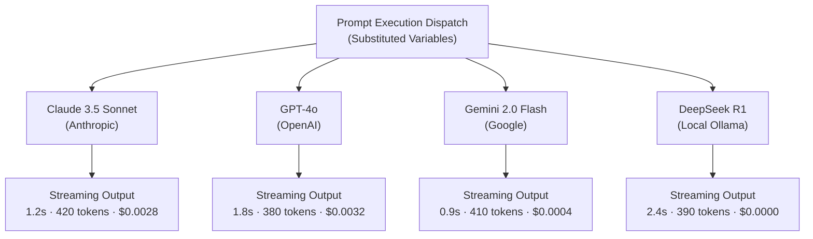

# Multi-Model Execution & Cost Tracking

PromptBranch allows you to execute prompts against real AI models directly within the application, comparing responses across up to **6 models concurrently** while tracking latency, token consumption, and dollar costs.

---

## Dynamic Template Variables

PromptBranch automatically scans your prompt for double curly brace placeholders: `{{variable_name}}`.

```markdown
Generate a unit test suite for the {{function_name}} function in {{language}}.
Requirements:
- Framework: {{test_framework}}
- Cover edge cases: {{edge_cases}}
```

### Filling Variable Values
- When you click **Run**, the **Run variables** dialog opens with an input field for each unique `{{variable}}` detected in the prompt.
- Values are safely substituted in the Electron main process immediately before dispatching requests to model providers.
- Test values are remembered per prompt, so you don't need to re-type them between runs.

---

## Multi-Model Concurrent Execution

Testing a prompt against one model doesn't guarantee it works across others. PromptBranch lets you execute your prompt across multiple providers simultaneously.



### Starting a Multi-Model Run
1. In the **Model Picker** dropdown next to the **Run** button, select up to 6 models from any of your connected providers (e.g. OpenAI, Anthropic, Google, or a local Ollama endpoint).
2. Fill in the run variables and click **Run**.
3. All models execute in parallel; the toolbar shows live progress (**Running n/m…**).

### Live Streaming & Execution Lifecycle
Each model in the run group streams into the compare view as it executes, with a per-model status chip:
1. **Queued**: Request initialized and scheduled.
2. **Streaming**: Tokens stream into the UI in real time.
3. **Done**: Stream finished — latency, tokens, and cost are recorded.
4. **Failed**: An API error, rate limit, or invalid key occurred; the specific error is shown while the other models continue uninterrupted.

### Cancelling In-Flight Runs
You can cancel in-flight executions at any time with the **Cancel** button in the compare view. PromptBranch sends an abort to every live stream and records unfinished runs as cancelled. Providers may still bill tokens already consumed before the abort takes effect.

---

## Token & Cost Tracking

PromptBranch tracks the economic and performance footprint of every prompt run.

### Metrics Captured per Run

| Metric | Source | Description |
| :--- | :--- | :--- |
| **`latency_ms`** | Local Timer | Milliseconds elapsed from request dispatch to final token receipt. |
| **Input Tokens** | Provider API | Prompt tokens reported by the provider, including variable substitutions when available. |
| **Output Tokens** | Provider API | Completion tokens reported by the provider when available. |
| **Estimated Cost (`costUsd`)** | [models.dev](https://models.dev) Catalog | USD estimate calculated from the locally cached input and output pricing. |

### Pricing Calculations
PromptBranch caches the latest pricing schema from `models.dev/api.json` and estimates cost from the input and output token counts and the model's per-million-token prices:

$$\text{Estimated Cost} = \frac{\text{Input Tokens} \times \text{Input Price} + \text{Output Tokens} \times \text{Output Price}}{1{,}000{,}000}$$

When a model has no pricing in the catalog (typical for local endpoints like Ollama or LM Studio), no cost is estimated — the UI shows a dash (`—`) instead of guessing.
