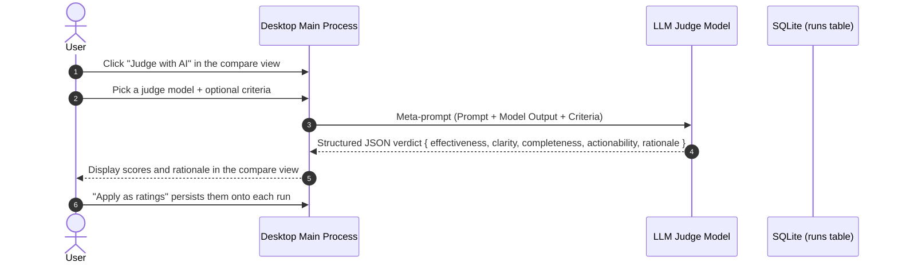

# LLM Judge & Empirical Evaluations

PromptBranch replaces subjective guesswork with structured, empirical evaluation. Using a standardized **4-dimension rubric**, an **automated LLM judge**, and a **side-by-side comparison matrix**, you can verify which prompt versions and models deliver superior results.

---

## The 4-Dimension Evaluation Rubric

Every model response can be evaluated across four distinct dimensions on a **1 to 5 scale**:

| Dimension | Scale | Definition & Criteria |
| :--- | :---: | :--- |
| **Effectiveness** | `1–5` | Does the response accomplish what the prompt explicitly asks for? |
| **Clarity** | `1–5` | Is the response clear, well-organized, and easy to follow? |
| **Completeness** | `1–5` | Does the response cover all constraints and parts of the prompt without gaps? |
| **Actionability** | `1–5` | Can the user act on the response directly, without rework or manual editing? |

The overall score is calculated as the unweighted arithmetic mean of the four dimensions.

---

## Automated LLM-as-Judge

Instead of manually rating hundreds of test runs, PromptBranch can invoke an LLM to act as a strict, impartial judge.

### How the Judge Works

1. **Per-Run Setup**: Clicking **Judge with AI** in the compare view header opens a dialog where you pick the **Judge model** and may add optional free-form **Criteria** (e.g. *"Penalize responses exceeding 300 words"* or *"Must include TypeScript types"*).
2. **Meta-Prompt Construction**: The judge prompt injects the original prompt content and the response generated by the candidate model.
3. **Structured Output Enforcement**: The judge request requires a structured JSON verdict that is validated against a strict schema.
4. **Parse & Validate Fallback**: For models that do not support native structured outputs, PromptBranch automatically retries with plain text and extracts the JSON verdict.
5. **Persisted Verdicts**: The judge produces four integer scores plus a concise rationale. Clicking **Apply as ratings** saves the verdict onto each run's metrics.

---

## Side-by-Side Run Compare View

When executing multi-model runs or testing different prompt versions, use the run compare view:

1. Open the **Results** tab and click any run group.
2. The compare view displays:
   - **Full Output**: Formatted markdown response for each model, side by side.
   - **Performance Stats**: Latency (ms), tokens, and estimated cost ($ USD) per model.
   - **Evaluation Scores**: Judge ratings for Effectiveness, Clarity, Completeness, and Actionability once applied.
   - **Judge Rationale**: The reasoning behind each score.

---

## Manual Ratings & Run Logging

In addition to automated LLM judging, you can record your own evaluations:
- **Four-Dimension Ratings (1–5)**: In the Inspector, rate the viewed version on the same Effectiveness / Clarity / Completeness / Actionability dimensions; averages are tracked per version.
- **Agent Reported Runs**: AI coding agents working via CLI or MCP can log their own run outcomes and 1–5 ratings using `report_run`, building an empirical history over time.
