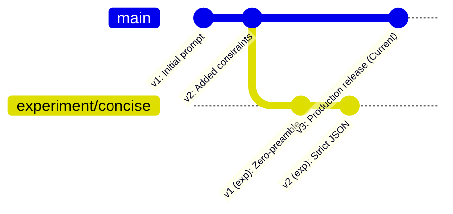

# Prompt Management & Versioning

Prompt management in PromptBranch combines a modern markdown editor with Git-style sequential versioning and variation branches.

---

## The Editor Interface

PromptBranch features a **CodeMirror 6** editor optimized for prompt authoring:

- **Three view modes**: **Edit**, **Split**, and **Preview** (a live, sanitized markdown rendering). Read-only historical versions always open in Preview.
- **Formatting toolbar**: One-click bold, italic, inline code, code fences, links, lists, and checklists.
- **Dynamic variable detection**: `{{variable_name}}` occurrences are highlighted, and each unique variable gets an input field in the run dialog.
- **Autosaving drafts**: In-progress edits are saved automatically as you type. This can be turned off in **Settings → Editor**; with autosave off, leaving the prompt discards uncommitted edits.

---

## Working with Drafts & Versions

PromptBranch prevents accidental commits while ensuring you never lose your work:

### 1. Live Drafts (`draft_content`)
- As you type, your text is automatically persisted to the prompt's draft.
- If you switch to another prompt, change tabs, or close the application, your uncommitted changes remain intact.
- The toolbar shows the current state: **Unsaved changes…** → **Draft saved {time}**, or **No unsaved changes** when the draft matches the committed version.

### 2. Committing a Version
When you reach a stable milestone, commit the version to the active branch:
1. Click **Save as new version** on the editor toolbar.
2. The *Save as v<N>* dialog opens with the next sequential version number. Enter a **change note** describing your modification (e.g. *"Added JSON schema output requirements"*).
3. Click **Save version**.
4. A new immutable version row is created and the version number increments sequentially (`v1` → `v2` → `v3`).

### 3. Returning to a Committed Version
Committed versions are immutable — the editor only ever edits the draft. To revisit or restore older content, pick a version from the version dropdown or the History tab; historical versions open read-only, and **Duplicate as variation…** copies any of them into a new editable branch.

---

## Variations (Branches)

Branches — called **variations** in the UI — let you test distinct versions of a prompt without touching your primary line.

### Creating a Variation
1. Open the **⋯** (More actions) menu on the prompt toolbar and click **Duplicate as variation…**. The version dropdown and the History tab offer per-version **Duplicate** buttons that do the same from any starting version.
2. Enter a **Variation name** (e.g. `few-shot-examples`, `json-mode`, `claude-3-7-opt`) and an optional description.
3. Click **Create variation**.

PromptBranch creates the new branch and commits the selected content as that branch's starting `v1`, then opens the editor for further modifications. Version numbering is per-branch.

### Switching Between Variations
The **version dropdown** on the toolbar lists versions grouped by branch. The prompt's one designated current version is marked **(Current)**. Selecting any other version previews it read-only; duplicate it as a variation to continue editing from that point.

---

## Version History & Diffing

PromptBranch tracks every iteration with a per-version history and a visual diff viewer.

### Browsing Version History
- The **History** tab groups every committed version by branch with author, timestamp, change note, and a **Current** badge on the designated version.
- Click any version to preview its exact content (read-only).
- The **(Current)** marker indicates which version is served to agents and integrations.

### Visual Diff Viewer
Compare any two versions side-by-side or unified:
1. In the History tab, select two version checkboxes and click **Compare versions**.
2. Toggle between **Side by side** and **Unified** modes.
3. Added and removed text are highlighted line by line.

---

## Setting the "Current" Version

The **Current Version** pointer (`current_version_id`) controls what agents and external tools receive:

- In the **History** tab, select the version you want to make active and click **Set as current** (confirm when prompted).
- When previewing a non-current version, a **Restore as current** banner offers the same action.
- The current version is what `get_prompt` returns in MCP and `promptbranch get` prints in the CLI by default.

---

## Soft Delete, Recovery & Trash

Prompts are never deleted permanently by accident.

### Soft Deleting a Prompt
- Open the **⋯** (More actions) menu on the prompt toolbar and choose **Delete**, then confirm **Move to Trash**.
- The prompt is timestamped with `deleted_at` and immediately hidden from standard search results, collections, and tag lists.

### Viewing and Restoring from Trash
1. In the left navigation rail, click **Trash**.
2. Browse your soft-deleted prompts.
3. Click **Restore** to bring a prompt back to your active library with all branches, versions, notes, and run history completely intact, or **Delete permanently** to wipe it for good.

### Emptying the Trash
In **Settings → Data & Backup**, the **Danger zone** offers **Permanently empty Trash** for all soft-deleted prompts at once.
