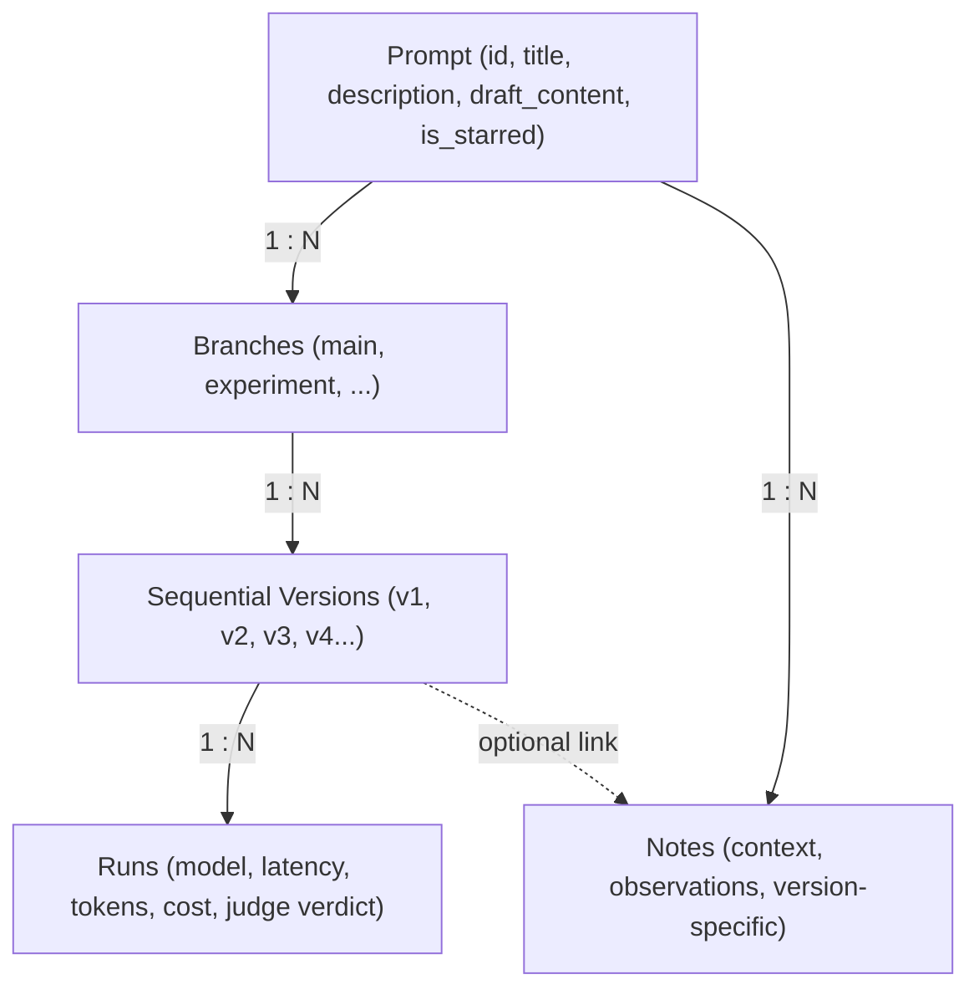
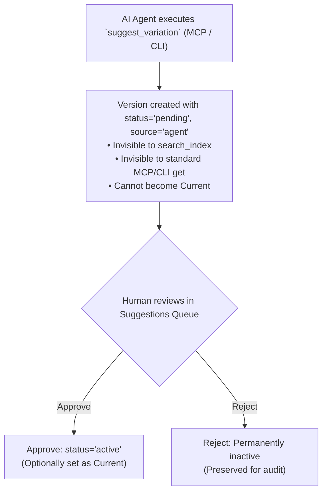

# Core Concepts

PromptBranch is designed around a clear, relational data model that treats prompts as versioned software components. Understanding these core concepts will help you get the most out of the system.

---

## The Data Hierarchy

---

## 1. Prompts

A **Prompt** is the top-level entity representing a prompt project (e.g., *"SQL Generator"*, *"Release Notes Writer"*).

Key prompt attributes:
- **`title`**: Human-readable name.
- **`description`**: Summary of the prompt's purpose and usage instructions.
- **`draft_content`**: A temporary scratchpad area where you can edit freely before committing a version.
- **`current_version_id`**: Foreign key pointing to the designated production version.
- **`is_starred`**: Quick-access favorite toggle for the left rail.
- **`deleted_at`**: Soft-delete timestamp. Prompts are never immediately purged; they move to **Trash** where they can be restored or permanently removed.

---

## 2. Branches

A **Branch** is an isolated stream of evolution within a prompt. Every prompt starts with a default **`main`** branch.

- **Unique per prompt**: Branch names are unique within a prompt (`UNIQUE(prompt_id, name)`).
- **Parallel experimentation**: Create feature or model-specific branches (such as `experiment/few-shot`, `claude-optimizations`, or `strict-json`) to test changes without disrupting the current working prompt.
- **Switching**: The version dropdown and History tab let you inspect versions from any branch. A prompt has one editable draft, while committed versions remain branch-specific.

---

## 3. Versions

A **Version** is an immutable, append-only snapshot of a prompt's text on a specific branch.

Key version attributes:
- **`number`**: Sequential integer allocated per branch (e.g. `1`, `2`, `3`...).
- **`content`**: The exact template text at that point in time.
- **`parent_version_id`**: Pointer to the previous version, forming an unbroken lineage graph.
- **`change_note`**: A commit-like description explaining *why* the change was made (e.g., *"Added guardrails against SQL injection"*).
- **`author`**: Identifier of who authored the version (defaults to `"You"` for humans, or the agent name for suggestions).
- **`status`**: Either **`active`** (ready for use) or **`pending`** (awaiting human approval).
- **`source`**: Origin tag: **`user`** (human-created version) or **`agent`** (suggested by MCP or CLI). Sync preserves the original source.

---

## 4. The "Current" Version Pointer

A prompt can have dozens of versions across multiple branches, but only one version is designated as the **Current Version** (`current_version_id`).

- When an AI agent fetches a prompt via MCP (`get_prompt`) or CLI (`promptbranch get "my-prompt"`), it automatically receives the **Current Version** unless a specific version or branch is explicitly requested.
- You can change the Current pointer at any time in the **History** tab by selecting a version and clicking **Set as current**.

---

## 5. Drafts vs. Committed Versions

PromptBranch separates casual editing from version commits:
1. **Live Draft (`draft_content`)**: With **Autosave drafts** enabled (the default), changes are debounced and saved to the prompt's `draft_content` column. You can close the app or switch prompts without losing uncommitted edits. When autosave is off, leaving the prompt discards uncommitted edits.
2. **Commit as Version**: When your changes are ready, click **Save as new version** and enter a change note. This creates an immutable row in the `versions` table and clears the draft.
3. **Draft state**: If an experiment fails, simply overwrite the draft or select a version from the dropdown to get back on track — committed versions are never modified by the editor.

---

## 6. Runs & Evaluation Records

Desktop model executions create **Run** records automatically. CLI and MCP agents can also report external executions into the same `runs` table:

- **`tool`**: Execution environment (`desktop`, `cli`, `kimi-cli`, `mcp`).
- **`provider`** & **`model`**: The AI model that generated the response (e.g. `anthropic:claude-3-5-sonnet-20241022`).
- **`latency_ms`**: Total execution duration from request to stream completion.
- **`metrics_json`**: Structured metadata containing:
  - `usage`: Input prompt tokens and generated output tokens.
  - `costUsd`: Estimated cost in US Dollars based on the locally cached catalog pricing.
  - `judgeScores`: 1–5 dimension ratings from the LLM judge.
  - `judgeRationale`: Explanation provided by the judge model.
- **`run_group_id`**: Shared identifier grouping concurrent multi-model runs together for side-by-side comparison.

---

## 7. The Agent Suggestion Lifecycle

To ensure human oversight, PromptBranch enforces a strict rule: **Agents propose, humans approve**.

---

## 8. Tags & Collections

- **Tags (`tags`)**: Flat, color-coded labels (e.g. `#production`, `#customer-support`, `#python`). A prompt can carry multiple tags.
- **Collections (`collections`)**: Curated folders / playlists (e.g. *"Q3 Marketing Campaign"*, *"Security Auditing Toolkit"*). Prompts can belong to multiple collections.

---

## 9. SQLite Store & Concurrency

PromptBranch runs on standard, embedded **SQLite 3** using `better-sqlite3`:
- **Write-Ahead Logging (WAL)**: Allows multiple processes (Desktop app, background CLI scripts, MCP daemon) to read and write concurrently without locking conflicts.
- **`busy_timeout = 3000`**: SQLite automatically waits up to 3 seconds for active write transactions to finish.
- **Local by default**: Library browsing, editing, search, and versioning stay on your machine. Model runs, catalog refreshes, sharing, update checks, and enabled peer sync use their respective network connections.
