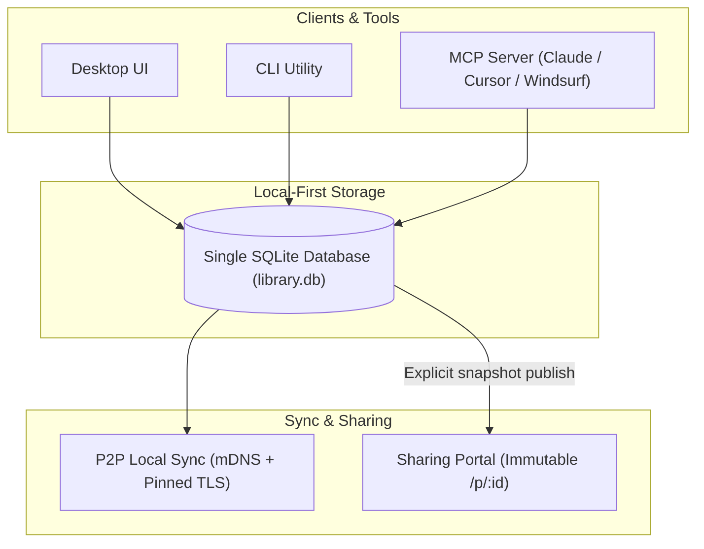

# Overview & Philosophy

**PromptBranch** is a cross-platform, local-first prompt library and version-control system for AI prompts. It bridges the gap between ad-hoc prompt testing and disciplined software engineering: treating prompts as first-class versioned code artifacts that evolve, branch, and improve with empirical evidence.

---

## Core Philosophy

### 1. Local-First & Sovereign Data
Your prompt library is stored in a single SQLite database file on your local disk. 
- **No mandatory cloud accounts** or subscription paywalls.
- **Offline by default**: browsing, versioning, searching, and managing prompts require zero internet connection.
- **Single Source of Truth**: The Desktop App, the CLI, and the MCP Server all read and write to the same database concurrently.

### 2. Version Control for Prompts
Prompts change as models update and tasks evolve. PromptBranch brings software engineering discipline to prompt engineering:
- **Append-Only Sequential Versions**: Every saved change records author attribution, timestamp, and a change note. Past versions are immutable.
- **Branching**: Fork experimental variations without breaking production prompts.
- **Visual Diffing**: Compare any two versions side-by-side or inline with line-level highlighting.
- **"Current" Pointer**: Decouple the latest experimental draft from the vetted production version.

### 3. Empirical Evaluation ("Evidence Over Vibes")
Testing a prompt against one model in a single chat box doesn't prove reliability.
- **Multi-Model Concurrent Runs**: Execute prompts across up to 6 models in parallel with dynamic `{{variable}}` substitution.
- **Token & Cost Tracking**: Track latency and provider-reported token usage, with estimated USD cost from the locally cached [models.dev](https://models.dev) catalog when pricing is available.
- **Automated LLM Judge**: Score responses objectively across four 1–5 dimensions (*Effectiveness*, *Clarity*, *Completeness*, *Actionability*) with an automated rationale.

### 4. Human-in-the-Loop Agent Integration ("Agents Propose, Humans Approve")
AI coding agents (via CLI or MCP in Claude Desktop, Cursor, or Windsurf) can read prompts, report run outcomes, and suggest variations.
- Suggested variations are created in a **`pending` status**.
- Pending suggestions are invisible to search and listings, and cannot become current until a human reviews and approves them in the **Suggestions** view.

### 5. Serverless Peer-to-Peer Sync
Sync your library across your macOS, Windows, and Linux machines over your local network:
- **No central server**: Devices discover each other via mDNS.
- **Cryptographic Trust**: Paired using an 8-character Signal-style code verified against self-signed TLS certificate fingerprints.
- **Deterministic Merge Engine**: Hybrid Logical Clocks (HLC) and Last-Writer-Wins (LWW) resolve conflicts automatically.

### 6. Safe, Unlisted Web Sharing
Publish immutable prompt snapshots to the official sharing portal:
- **Unguessable URLs**: Shared prompts live at `/p/<snapshot-id>`.
- **Pre-Publish Secret Scanner**: Automatically detects and blocks API keys, tokens, and private keys before anything leaves your machine.
- **Revocable Delete Tokens**: 256-bit cryptographic tokens stored locally allow you to take down published snapshots at any time.

---

## License

PromptBranch is open source under the **MIT License**. The licenses of every bundled third-party package are bundled with the app and viewable in-product via **About PromptBranch → Open Source Licenses** (also in **Settings → About**).

---

## Next Steps

- [Installation & Setup](installation.md) — Get the desktop app, CLI, or MCP server running on your computer.
- [5-Minute Quickstart](quickstart.md) — Create your first prompt, run it across models, and branch it.
- [Core Concepts](core-concepts.md) — Understand versions, branches, runs, and ratings under the hood.
