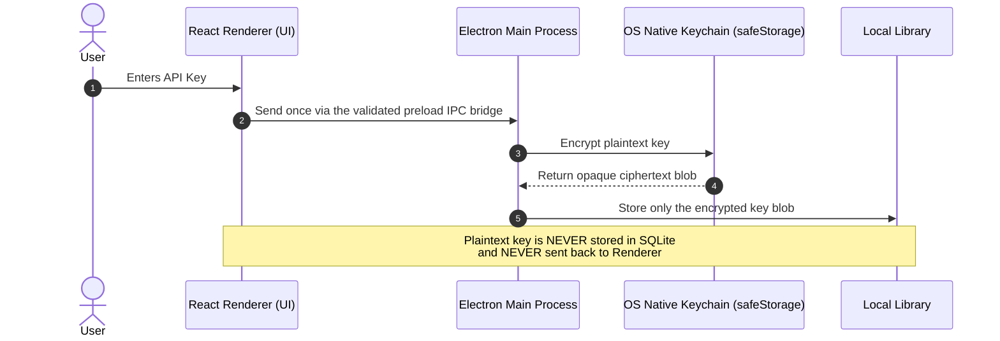

# AI Providers & Key Encryption

PromptBranch connects directly to major cloud AI providers and any OpenAI-compatible local endpoint. API keys are encrypted with your operating system's native keychain before they are stored.

---

## Supported Providers

The **Connect a provider…** dialog lists every provider in the community-maintained [models.dev](https://models.dev) catalog:

| Provider Type | Examples | Execution Driver |
| :--- | :--- | :--- |
| **OpenAI** | GPT family, o-series reasoning models | `openai` |
| **Anthropic** | Claude family | `anthropic` |
| **Google** | Gemini family | `google` |
| **OpenAI-compatible** | Groq, Mistral, Together AI, xAI, DeepSeek, Perplexity, … | `openai-compatible` |
| **Custom endpoint** | Ollama, LM Studio, vLLM, LocalAI — anything speaking the OpenAI HTTP API | `openai-compatible` |

Popular providers (OpenAI, Anthropic, Google) are pinned at the top of the list; the rest follow alphabetically with model, context-window, and pricing data from the locally cached catalog when available.

---

## Connecting a Provider

1. In PromptBranch, open **Settings** (<kbd>⌘,</kbd> / <kbd>Ctrl+,</kbd>) and navigate to **AI Providers**.
2. Click **Connect a provider…**.
3. Select a provider from the catalog list — or **Custom OpenAI-compatible provider** for a local or self-hosted endpoint.
4. Enter your API Key.
5. Click **Connect**. PromptBranch verifies authentication with a minimal test request ("Reply with: ok") before saving the connection.

### One-Click Environment Key Detection
If standard provider API keys are defined in your shell environment (`OPENAI_API_KEY`, `ANTHROPIC_API_KEY`, or `GOOGLE_GENERATIVE_AI_API_KEY`), PromptBranch automatically detects them and displays a **Use environment key** button for instant setup.

---

## Connecting Local Endpoints (Ollama, LM Studio)

PromptBranch fully supports local, private, offline inference via any OpenAI-compatible HTTP endpoint.

### Ollama Setup
1. Ensure Ollama is running locally (`ollama serve`).
2. In Settings → AI Providers, click **Connect a provider…** and choose **Custom OpenAI-compatible provider**.
3. Set **Base URL**: `http://localhost:11434/v1`.
4. Pick or enter a **Test model** you have pulled locally, then click **Connect**.
5. After connecting, open **Manage models** and add your installed model IDs (e.g. `llama3.1:8b`, `deepseek-r1:8b`, `qwen2.5-coder:7b`) so they appear in the run picker.

### LM Studio Setup
1. In LM Studio, start the Local Server on port `1234`.
2. Connect a custom OpenAI-compatible provider with **Base URL** `http://localhost:1234/v1`.
3. Add your loaded model IDs under **Manage models**.

---

## Security & OS Keychain Encryption (`safeStorage`)

PromptBranch treats API keys with uncompromising security:

- **`safeStorage`**: API keys are encrypted at rest using your operating system's native cryptographic keychain (macOS Keychain, Windows DPAPI, or Linux Secret Service).
- **Renderer Isolation**: The renderer necessarily holds a key while you type it, then sends it once to the main process. Stored keys are never returned to or decrypted in the renderer.
- **Export & Sync Safety**: Library JSON exports can include provider metadata and model declarations, but the `api_key_enc` field is cleared. Multi-device sync also redacts that field, so keys must be configured separately on each device.

---

## The Model Catalog (`models.dev`)

PromptBranch integrates with the community-maintained **[models.dev](https://models.dev)** catalog:

- **Catalog Model Data**: Context window sizes, output limits, and input/output pricing per million tokens when models.dev supplies them.
- **Offline Cache**: Catalog data is cached locally. If your machine is offline, PromptBranch keeps operating with the cached catalog; a failed refresh never clobbers a good cache.
- **Managing Model Visibility**: In Settings → AI Providers, click **Manage models** to hide models you don't use from the run picker, add custom model IDs for local endpoints, or bring hidden models back.
