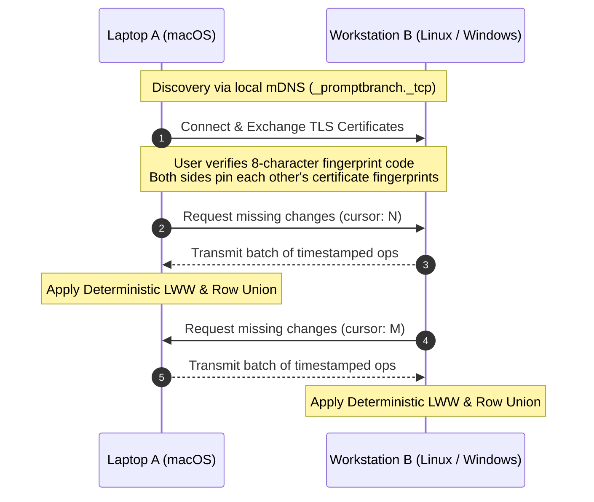

# Peer-to-Peer Multi-Device Sync

PromptBranch includes a **serverless, peer-to-peer (P2P) sync engine** that synchronizes your prompt library directly between your computers across your local network without any cloud servers or user accounts.

---

## How It Works

### 1. Zero Cloud & Local Discovery
- **mDNS / Bonjour Advertising**: When enabled in **Settings → Sync**, PromptBranch advertises a local service (`_promptbranch._tcp`) on your Wi-Fi or LAN.
- **VPN & Tailscale Support**: If devices are on different subnets or connected via Tailscale/WireGuard, you can pair directly by IP address or hostname.

### 2. Cryptographic Pairing & Mutual TLS
- **Self-Signed Certificates**: The first time sync is enabled, each device generates a self-signed TLS certificate and private key stored locally in your PromptBranch data directory (never in the shared library database).
- **Signal-Style Pairing Code**: When pairing two devices, an **8-character verification code** is derived mathematically from the accepting device's TLS certificate fingerprint.
- **Certificate Pinning**: Once paired, each device pins the other's certificate fingerprint. Any subsequent connection with an altered certificate is immediately rejected.

### 3. Automatic Change Capture
Every write to your library—whether performed in the Desktop UI, via shell commands in the CLI, or by coding agents through the MCP server—is automatically captured into a local change log. Nothing is ever "pending upload": a change is durable the moment it is written.

### 4. Hybrid Logical Clocks (HLC)
Captured changes are refined into timestamped sync operations using a **Hybrid Logical Clock (HLC)**. HLCs combine physical system time with a monotonic counter, guaranteeing strict causal ordering even if system clocks drift across machines.

### 5. Deterministic Conflict Resolution
When devices exchange ops, the sync engine applies changes with mathematical determinism:
- **Append-Only Records (versions, notes, ratings, runs)**: Unioned by ID. Concurrent edits to a prompt simply create concurrent versions in its history graph.
- **Mutable Entities (prompts)**: Small mutable fields (e.g. `title`, `description`, starred status) resolve using **Last-Writer-Wins (LWW)** based on HLC timestamps (with device ID as a deterministic tiebreaker).
- **Natural Key Merging (tags, collections, branches)**: Tags, collections, and branches with matching unique names merge cleanly into a single row.

### 6. Device-Local Data Isolation
Certain data is strictly isolated to the host machine and is **never synchronized**:
- Device settings (portal configuration, catalog cache, local window states).
- Encrypted provider API keys (they remain strictly on the local machine).

> [!NOTE]
> Published share records and their delete tokens **do synchronize** across your paired devices, allowing you to manage and revoke your shares from any of your computers.

---

## Pairing Devices Step-by-Step

### Step 1: Enable Sync on Both Machines
1. On **Computer A** and **Computer B**, open **Settings → Sync**.
2. Toggle **Device-to-device sync** to ON.
3. If macOS displays a **Local Network** permission prompt, click **Allow**.

### Step 2: Initiate Pairing
1. On **Computer A**, click **Add a device** and choose **Show pairing code**.
2. Computer A displays an **8-character pairing code** in the form `XXXX-XXXX`.
3. On **Computer B**, click **Add a device**:
   - Pick Computer A from the **discovered nearby devices** list, or
   - Use **Pair by address** (VPNs, manual setup) and enter Computer A's IP/hostname and port.
4. Type in the pairing code and confirm.
5. Both computers verify the mutual TLS fingerprints, pin each other's certificates, and immediately exchange any missing history.

---

## Sync Status Indicator

The bottom of the left navigation rail displays live sync status:
- ● **Synced with \<device\>**: Up to date with your paired device.
- ● **Syncing…**: Active op exchange in progress.
- ● **\<device\> offline**: The paired device is not connected. PromptBranch keeps retrying in the background and turns green again once it reconnects.
- ● **Waiting for devices**: Online and waiting for paired peers to join the network.
- ● **No devices paired**: Sync is on but nothing is paired yet.
- ● **Sync keeps failing**: Repeated connection failures — check the network or the other device.

---

## Forgetting / Unpinning Devices

To revoke access for a paired device:
1. Go to **Settings → Sync**.
2. Under **Paired devices**, click the trash icon next to the device (**Forget \<device\>**).
3. The peer's certificate is unpinned and any live connection is closed. Automatic reconnects are rejected unless you intentionally pair the devices again with a new pairing flow.
