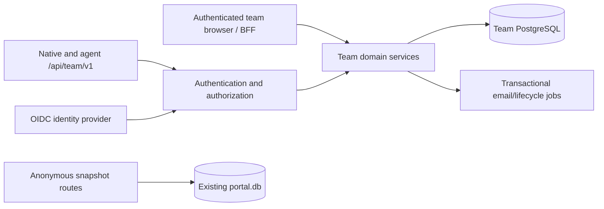

# PromptBranch Portal Team Workspaces Implementation Plan

> **For agentic workers:** Use `superpowers:executing-plans` to implement this plan task-by-task, or `superpowers:subagent-driven-development` if the user explicitly chooses delegation. Steps use checkbox syntax for tracking. This file is a complete handoff; no conversation or other plan is required.

**Goal:** Add authenticated accounts, private workspaces, invitations, member permissions, reviewed prompt libraries, team APIs and operational support to the Portal repository.

**Architecture:** Keep the existing anonymous snapshot service isolated and add an authenticated team service within the Next.js deployment. Store team data in PostgreSQL through a separate Node package, use a configurable OIDC identity provider, enforce all membership/approval rules server-side, and publish a transactional approved-catalogue change feed consumed by desktop/CLI/MCP.

**Tech Stack:** Existing pnpm 11.7.0, strict TypeScript/ESM, Next.js/React/Zod/Vitest; new `@promptbranch/team-server`, `pg`, `openid-client`, `jose`; PostgreSQL 18 reference deployment and Keycloak reference OIDC provider. Retain SQLite for existing snapshot storage. Lock supported patch versions and container digests during P0; do not use floating `latest`.

**Spec:** Requirements, architecture, tasks and complete embedded PB-TEAM-1 below are normative. This plan resolves the earlier proposal's options. It is self-contained; source-code inspection is still required before editing.

## 1. Baseline, working rules and scope

Repository: `/Users/shai/Desktop/Code/china/PromptBranch-Portal`; working branch
`feature/teams-portal`. Reviewed baseline
`89665ff6256631665f9e834c2198575552e9da2b`, clean working tree. Re-read AGENTS.md,
current package scripts/status/remotes/branch before work; don't reset to this
hash if the repository has advanced. The manifest at review has Next.js 16.3.5
and Vitest 5.0.0, while AGENTS.md still describes older versions. Treat manifests
and actual runtime as authoritative; correct relevant internal guidance as part
of this feature rather than repeating stale version claims.

Own only this repository. The main PromptBranch implementer owns the shared
contract package, client persistence and desktop/CLI/MCP. Continue on the
existing `feature/teams-portal` branch; do not create or switch to a `codex/*`
branch. Preserve others' edits and follow the repository's normal PR promotion
policy. Do not deploy production,
publish npm artifacts, send real invitation emails or create real customers as
part of local implementation. Synthetic local accounts/email capture are expected.

Planning files are internal material. Keep them under `docs-internal/`; don't
serve them from `src/docs-content`, landing pages, sitemap or llms endpoints.
The earlier proposal is unnecessary for executing this file.

### Global constraints

- Preserve anonymous snapshot POST/GET/DELETE, immutable payloads, token hashing,
  mandatory secret scan, scan-before-publication, sanitize-before-highlight,
  public route payload caps, noindex, self-contained viewer and no analytics.
- Authenticated team routes may set sessions. This deliberately extends the
  current cookie-free invariant only for login/team surfaces; public viewers
  never create team sessions or redirect to sign-in.
- Team authorization is server-side on every API, SSR read, export, search,
  preview and feed page. Middleware hiding navigation is not authorization.
- New team data uses PostgreSQL only. Do not migrate anonymous snapshots to it
  incidentally, point desktop at it directly, or import SQLite PromptLibrary
  as the server's mutable domain engine.
- Parameterized SQL via `pg`, explicit forward-only SQL migrations, transaction
  service functions; no second ORM/domain model. Use Zod from the shared contract.
- Approved revision text is immutable. Pending/rejected candidates never appear
  in catalogue queries/search/exact-revision endpoints/bootstrap/change feed.
- No public team links, centralized AI keys, server model execution, per-folder
  ACLs, billing or live collaborative text editing in v1.
- Fail closed if the team DB/identity checks are unavailable; public snapshot
  service may continue independently. No “temporary public” fallback.
- Keep secrets in environment/secret files, not git or fixtures. Synthetic fixed
  test credentials only in explicitly local development realm configuration.

### Review focus

1. A valid ID from another workspace reaches a nested route/FK/receipt lookup:
   return no data and no cross-workspace mutation (P1/P3/P4/P8).
2. A reviewed candidate changes, two maintainers approve concurrently, or a
   proposal's author uses an agent token: approvals bind immutable exact content
   and independent human identity (P4/P6).
3. Feed/initial snapshot races commit order: no missing events, skipped revisions
   or partial bootstrap (P5 with real PostgreSQL concurrency tests).
4. Member removed or demoted during command retry/export: recheck current access;
   don't return stale receipts/secrets or accept old generation (P3/P5/P8/P9).
5. Restore from an old backup revives deleted membership/token or private CDN
   metadata: recovery mode invalidates credentials and reconciles membership;
   private HTML/metadata never uses public caches (P8/P9).

## 2. Product stories and user experience

| Epic | User story and acceptance | Tasks |
|---|---|---|
| PX-01 Identity | As a user I sign in with a verified identity, see joined workspaces and sign out/revoke a device without affecting anonymous sharing | P2,P7 |
| PX-02 Membership | As an owner I invite a specific email, change role, revoke invite, remove a member and transfer ownership; the last owner cannot disappear | P3,P7 |
| PX-03 Shared library | As a viewer I browse/search/copy approved prompts, navigate published history and filter tags/collections without installing desktop | P4,P7 |
| PX-04 Contribution | As a contributor I draft privately, propose an exact change with rationale and discuss it; ordinary catalogue users cannot see candidates | P4,P7 |
| PX-05 Review | As a maintainer I compare base/candidate, approve/reject another member's work, and roll back to a published revision with attribution | P4,P7 |
| PX-06 Native clients | As a desktop member I bootstrap and resume approved changes across networks without peer pairing or SQL access | P5 |
| PX-07 Agents | As a member I mint/revoke a narrow agent credential; an agent can read/suggest/report but cannot become a reviewer | P6 |
| PX-08 Accountability | As an owner I inspect actor/time/resource audit, export data and delete a workspace with documented retention | P3,P9 |
| PX-09 Reliability | As operator I migrate, restore, monitor and upgrade without losing approved history or reopening revoked access | P8,P9,P10 |

Reference browser routes: `/team` workspace picker; `/team/new` create;
`/team/w/:workspaceId/library`; `/prompts/:promptId`; `/proposals`;
`/proposals/:proposalId`; `/settings/members`; `/settings/agents`;
`/settings/audit`; `/settings/general`; `/team/account`; `/team/invitations/accept`.
Routes beneath `/team/w/:workspaceId` share an authenticated, workspace-aware
layout. Use stable generic metadata before auth. No public OpenGraph description
derived from team content. Existing `/p/:id` is always anonymous snapshot content.

Browser drafts are per-user/per-workspace private session drafts, never stored in
the shared server catalogue. Use sessionStorage with explicit “Saved in this tab”
copy and clear on logout/removal; provide a download-draft recovery action. Warn
before closing with an unsubmitted draft. Cross-device private draft sync is not
part of v1. Desktop has durable disk drafts under its own plan.

## 3. Architecture, boundaries and files



Use the same domain services from SSR and API handlers; no separate authorization
implementation in UI code. Server components call authorized services, not
loopback HTTP to their own API. Route adapters validate inputs with the contract,
resolve principal, call service, return mapped DTOs and stable errors. Never pass
database rows containing hashes/tokens to components.

| Create/modify | Responsibility |
|---|---|
| `packages/team-server/{package.json,tsconfig.json,tsconfig.build.json,vitest.config.ts}` | Node-only server package and test/build commands |
| `packages/team-server/src/{index,config,db,migrations,errors}.ts`; `migrations/001-team-foundation.sql` onward | Pool, transaction runner, migrations, readiness; parameterized SQL |
| `src/auth/{oidc,principal,sessions,agent-tokens}.ts` within team-server | OIDC validation, account mapping, revocable sessions, scoped bearer tokens |
| `src/domain/{authorization,workspaces,memberships,invitations,prompts,revisions,proposals,organization,activity,audit}.ts` | Workspace-bound domain services |
| `src/sync/{bootstrap,changes,cursors}.ts`; `src/commands/{dispatch,receipts}.ts` | Snapshot/feed and atomic domain command handling |
| `src/jobs/{outbox,worker,email,lifecycle}.ts`; `src/exports/workspace.ts` | Email/purge/recovery jobs and export |
| `packages/team-server/tests/{helpers,auth,workspaces,permissions,revisions,proposals,commands,feed,bootstrap,agents,exports,recovery}.*` | Real Postgres fixture integration suites and unit helpers |
| `apps/portal/src/lib/team/{env,service,auth,csrf,http}.ts` | Next adapter/config/service singleton; authenticated SSR helper |
| `apps/portal/src/app/api/team/v1/**/route.ts` | Exact C4 API routes, each thin adapter |
| `apps/portal/src/app/team/**/{page,layout}.tsx`; `src/components/team/**` | Browser product screens, forms, role-aware actions, error/freshness UI |
| `apps/portal/src/app/team/auth/{login,callback,logout}/route.ts` | OIDC BFF; login callback, CSRF-protected logout |
| `apps/portal/src/middleware.ts`, `next.config.ts`, `src/app/{robots,sitemap}.ts` | Private route headers/CSP and indexing separation |
| `apps/portal/tests/team-*.test.{ts,tsx}` | Route/component regressions |
| `deploy/team/{compose.dev.yml,compose.yml,realm.dev.json,.env.example,README.md}` | Local Postgres/IdP/mail capture and opt-in production overlay |
| `scripts/{team-migrate,team-worker,team-fixtures,team-integration,team-backup,team-restore}.mjs` | Reproducible jobs, test fixture launcher, ops commands |
| Portal `package.json`, root scripts, Dockerfile/compose/CI | Include server dependency/migrations; real database CI lane |

`@promptbranch/team-contract` is consumed at an exact version/artifact owned by
main PromptBranch. Do not create a second contract package here. Existing
`packages/share` remains the snapshot/scanner dependency; scanner behavior must
match main for shared inputs, with drift coverage already used by the repos.
The main agent can develop against mock while this agent develops server tests
against the same fixtures. Neither agent edits the other's repo to make tests pass.

### PostgreSQL model and integrity

Use UUID PKs generated server-side and timestamptz. Every workspace-owned table
has `workspace_id NOT NULL`; every cross-table relationship includes that column
in a composite FK. Reject objects belonging to another workspace even if an
application check is accidentally missing. Opaque token hashes use bytea;
provider refresh-token encryption stores nonce/ciphertext/key ID separately.
Minimum tables and indexes:

| Table | Required columns/constraints |
|---|---|
| `team_users` | id, issuer, subject, verified_email, normalized_email, display_name, disabled_at, deleted_at; unique issuer+subject; email not account identity |
| `team_sessions` | id, user_id, issuer, sid, client_id, revoked_at, created_at,last_seen_at; unique issuer+sid+client+user; retain revoked rows to prevent re-registration |
| `team_web_sessions` | token_hash PK, app_session_id, encrypted_refresh, expires_at, csrf_hash; no raw cookie |
| `team_workspaces` | id,name,entity_version,next_catalog_seq,server_epoch,deleted_at,purge_after; row is serialization lock |
| `team_memberships` | workspace_id,user_id,role,generation UUID,entity_version,removed_at; PK workspace+user |
| `team_invitations` | id,workspace_id,email,role,token_hash,expires_at,accepted_by,accepted_at,revoked_at; token hash unique; no owner invite |
| `team_prompts` | workspace_id,id,title,description,approved_revision_id,entity_version,archived_at,created_at,updated_at; unique workspace+id |
| `team_revisions` | workspace_id,id,prompt_id,parent_revision_id,content,content_hash,change_note,author_user_id,author_agent_id,created_at; immutable fields; display name derived from user presentation |
| `team_publications` | workspace_id,revision_id,prompt_id,source:seed/review,review_id nullable,published_at; revision unique; catalogue joins this table |
| `team_proposals` | workspace_id,id,prompt_id,base_revision_id,candidate_revision_id,author_user_id,author_agent_id,rationale,status,supersedes_id,entity_version,timestamps |
| `team_reviews` | workspace_id,id,proposal_id,candidate_revision_id,candidate_hash,reviewer_user_id,decision,comment,created_at; proposal terminal decision unique |
| `team_tags`, `team_collections` | workspace_id,id,name,normalized_name,entity_version; unique workspace+normalized_name |
| `team_prompt_tags`, `team_collection_prompts` | workspace-scoped junctions, composite FKs and uniqueness |
| `team_comments` | workspace_id,id,proposal_id,author_user_id,author_agent_id,body,created_at; append-only |
| `team_activity_items` | workspace_id,id,prompt_id,revision_id,kind,body,run_json,author_user_id,author_agent_id,created_at; no provider credentials/outputs |
| `team_agent_tokens` | workspace_id,id,owner_user_id,name,secret_hash,scopes,expires_at,revoked_at,created_at; generation binding |
| `team_command_receipts` | workspace_id,principal_id,command_id,request_hash,result_json,committed_at; unique workspace+principal+command |
| `team_user_receipts` | user_id,command_id,request_hash,result_json; create workspace/invite acceptance only |
| `team_audit` | workspace_id,id,actor user/token IDs,action,resource_type,resource_id,created_at; metadata-only, append-only |
| `team_changes` | workspace_id,seq,payload_json,created_at; PK workspace+seq, index age for retention |
| `team_bootstraps`, `team_bootstrap_rows` | snapshot_id,workspace,principal,generation,epoch,high_water,expires_at; snapshot+ordinal rows, indexed expiry |
| `team_jobs` | id,workspace_id nullable,type,payload_encrypted/status,attempts,run_after,locked_until,last_error_code; invitation raw token encrypted only until email job completes |
| `team_rate_buckets` | bucket_key,window_start,count,expires_at; atomic limits across app instances |

Example mandatory FK shape:

```sql
ALTER TABLE team_revisions ADD CONSTRAINT revisions_same_prompt
  FOREIGN KEY (workspace_id, prompt_id) REFERENCES team_prompts(workspace_id,id);
ALTER TABLE team_proposals ADD CONSTRAINT candidate_same_prompt
  FOREIGN KEY (workspace_id,prompt_id,candidate_revision_id)
  REFERENCES team_revisions(workspace_id,prompt_id,id);
```

Create the required unique `(workspace_id,prompt_id,id)` key for that reference;
apply it to base/parent/review/publication/approved pointer relationships too.
For prompt creation's circular FK use a deferrable initially-deferred constraint,
not a period where an unapproved head is observable. DB trigger rejects UPDATE
of revision content/hash/parent/author; lifecycle purge uses controlled DELETE.
Use CHECK constraints for role/status/kind, positive entity versions and metrics.

Published search index is a workspace-scoped tsvector projection from prompt
metadata plus the current approved revision only, weighted title/tags first.
Maintain it in the same mutation transaction; never search raw candidate rows.
History endpoint returns published revisions, not all revisions by prompt ID.
Index memberships by user and active state, proposals by workspace/status/time,
revisions by workspace/prompt, audit/feed by workspace+sequence/time.

### Transaction service interfaces

```ts
type Principal =
  | {kind:"human"; userId:string; sessionId:string; authenticatedAt:string}
  | {kind:"agent"; userId:string; tokenId:string; scopes:Scope[]};
interface TeamService {
  execute(principal:Principal, workspaceId:string, epoch:string,
    command:CommandEnvelope): Promise<CommandReceipt>;
  getPrompt(principal:Principal, workspaceId:string, promptId:string): Promise<{prompt:Prompt;revision:Revision}>;
  startBootstrap(principal:Principal, workspaceId:string, input:BootstrapInput): Promise<BootstrapStart>;
  bootstrapPage(principal:Principal, workspaceId:string, snapshotId:string, pageToken?:string): Promise<BootstrapPage>;
  changes(principal:Principal, workspaceId:string, input:ChangesInput): Promise<ChangesPage>;
}
```

Contract types above are defined in the embedded contract/C4 export mapping.
`authenticateRequest`, `authorizeWorkspace`, `withWorkspaceTransaction`,
`executeTeamCommand` are internal entrypoints created by P1/P2/P3. Every public
service requires Principal; no exported unauthenticated `getById` service.
SQL query helpers remain internal and require transaction + workspace arguments.

## 4. Phases, deliverables and independent development

| Phase | Portal tasks | Main-side input | Output |
|---|---|---|---|
| A Contract/infrastructure | P0,P1 | D0 package/fixtures | Real PG domain foundation + G0 |
| B Identity and membership | P2,P3 | Native callback/client IDs from contract | Testable login/invite/role service |
| C Team content | P4,P5 | Mock consumer tests | Approved library/reviews/feed API |
| D User workflows | P6,P7 | Agent client integration | Browser product and agent scopes |
| E Reliability and rollout | P8–P10 | D10 real native client | G1–G5, operated pilot |

Dependencies: P0 -> P1 -> P2 -> P3 -> P4 -> P5;
P3+P4 -> P6; P2+P3+P4 -> P7; all -> P8; P3+P5+P6 -> P9;
P7+P8+P9 -> P10. P7 UI development can use fixture-backed services before all
backend handlers are ready, but cannot claim permission validation from mocks.

## 5. Executable epics and tasks

Each task includes its own negative tests and a reviewable deliverable. Execute
red/green focused tests, typecheck, then commit. Use current repository commit
convention. Keep a gate ledger with exact commands/commit hashes and remaining
blocks. Never label mocked identity or direct handler tests as browser/network proof.

### P0 — Acquire contract, pin tools and establish reproducible local stack

**Files:** root scripts/manifests, `deploy/team/{compose.dev.yml,realm.dev.json,.env.example}`,
`scripts/team-fixtures.mjs`, `apps/portal/tests/team-contract.test.ts`.
**Consumes:** main D0 tarball/version/hash or published immutable package.
**Produces:** accepted contract, local PostgreSQL/Keycloak/mail capture and test URLs.

- [ ] Record baseline git/scripts/manifests. Add exact contract artifact locally;
  run fixtures through imported runtime schemas. If artifact has not arrived,
  work on local Compose/DB migrations from this plan, but do not create a private
  fork of the DTO schemas. Record G0 pending until artifact exists.
  ```ts
  expect(commandEnvelopeSchema.parse(fixtures.proposalSubmit)).toEqual(fixtures.proposalSubmit);
  expect(teamInfoSchema.parse(fixtures.info).protocol).toBe(1);
  ```
- [ ] Pin PostgreSQL 18 patch and Keycloak supported image by digest after checking
  official release/security support. Use separate DB roles/databases for team and
  Keycloak. No production addresses in development realm. Seed Alice/Bob/Casey/
  Dana/Erin synthetic identities with verified local test email addresses.
- [ ] Configure reference clients/audience/sid/auth_time/verified email/PKCE/device
  flow per C5; disable password/implicit grants for PromptBranch clients. Loopback
  callbacks only for public native client; exact HTTPS callback for web in production.
- [ ] Add scripts `team:dev:up`, `team:dev:down`, `team:fixtures`, `test:team`.
  `team:fixtures` refuses non-loopback/non-synthetic config. SMTP points to local
  capture container. Verify the same fixture artifact against real route outputs
  as each service lands. Commit `feat(team): establish contract and local stack`.

### P1 — Persistence, migrations, transaction runner and test harness

**Files:** new `packages/team-server` config, db/migrations/errors and SQL files;
`tests/helpers.ts`, `tests/db.test.ts`, script `team-migrate.mjs`.
**Consumes:** P0 PostgreSQL. **Produces:** migration CLI, pool, isolated test DBs,
`withWorkspaceTransaction` and domain test helpers.

- [ ] Create `createTeamTestHarness()` returning a real scratch PG database,
  factory `asUser(name)`/`asAgent(id)`, seed helpers, `service` and `close()`;
  later tasks implement services without replacing PG with SQLite. Each suite
  gets isolated schema/database and a separate connection for concurrency races.
- [ ] Test fresh migrate/re-run/upgraded migration chain, advisory migration lock,
  cross-workspace composite FK rejection, immutable revision UPDATE rejection,
  transaction rollback and connection cleanup.
  ```ts
  await expect(h.insertCrossWorkspaceCandidate()).rejects.toMatchObject({code:"23503"});
  expect(await h.count("team_proposals")).toBe(0);
  ```
- [ ] Implement one named forward-only migration per coherent schema slice. Run
  migrations once as deploy job, not automatically from all web workers. App role
  gets DML, migration role DDL. Transaction helper locks workspace first and rolls
  back on validation/authorization failure; serialization/deadlock retry uses same
  command ID, maximum 3 attempts.
- [ ] Add package scripts `build`, `typecheck`, `test` and root `team:migrate`.
  Run `pnpm --filter @promptbranch/team-server test` with TEAM_TEST_DATABASE_URL.
  Commit `feat(team): add transactional PostgreSQL storage`.

### P2 — Accounts, OIDC, web sessions and device-session revocation

**Files:** team-server auth modules, Portal lib/team auth/csrf,
`app/team/auth/**/route.ts`, `/api/team/v1/{info,me,sessions}/**`, auth tests.
**Consumes:** P0 provider profile, P1 storage, C5. **Produces:** Principal from
validated native bearer, agent bearer (P6), or browser opaque session.

- [ ] Test invalid signature/issuer/audience/azp, ID-token misuse, missing verified
  email/sid, state/nonce mismatch, callback replay, expired/reused refresh token,
  mixed cookie+bearer, CSRF and disabled/revoked session. Cookie not emitted on `/p`.
  ```ts
  expect((await h.request("/api/team/v1/me", {bearer:h.wrongAudienceToken})).status).toBe(401);
  expect((await h.publicSnapshot()).headers.get("set-cookie")).toBeNull();
  ```
- [ ] Implement `openid-client` web code+PKCE, secure correlation cookie/session,
  encrypted server refresh token, verified account mapping by issuer+sub, `jose`
  access token validation with bounded JWKS caching and rotation refresh. Trusted
  issuer is operator-configured; don't fetch issuer/JWKS from untrusted token fields.
- [ ] Resolve application session for each validated sid/client; revoked rows
  cannot auto-register. Add `/me`, session list/revoke/revoke-all and fresh-login
  account deletion with last-owner protection (final lifecycle jobs in P9).
- [ ] Add `/principal` for both human and scoped agent identity. Never use
  client-provided user/principal IDs to choose ownership or cache namespaces.
- [ ] Web session inactivity 24h, absolute 30 days; compare IdP expiry too.
  Serialize refresh per session; don't race refresh rotation across instances.
  CSRF cookie mutations require stored token + same-origin Origin; auth GET
  callback instead validates state/nonce. Rate-limit login endpoints.
- [ ] Run real browser login and real desktop/CLI OIDC smoke with local provider;
  record G1 partial until both clients pass. Commit `feat(auth): add verified team accounts and sessions`.

### P3 — Workspaces, memberships, invitations and audited command dispatch

**Files:** domain authorization/workspaces/memberships/invitations/audit,
commands dispatch/receipts, jobs outbox/email, route adapters and tests.
**Consumes:** Principal, PG transaction, contract operation union.
**Produces:** server-enforced role matrix, idempotency, owner controls.

- [ ] Table-drive every role × operation × same/foreign workspace case; test
  last-owner races from two connections, invitation replay/expiry/wrong verified
  identity, email-scanner GET, removed member receipt replay, re-add generation.
  ```ts
  const receipt = await h.service.execute(h.asUser("Alice"), w, epoch, command);
  await h.removeMember(w,"Alice", {replacementOwner:"Bob"});
  await expect(h.service.execute(h.asUser("Alice"),w,epoch,command))
    .rejects.toMatchObject({code:"WORKSPACE_FORBIDDEN"});
  ```
- [ ] Dispatch through strict union; lock workspace/member; reject before receipt
  lookup if unauthorized. Canonical JSON hash includes complete operation and
  generation. Append audit and receipt in same transaction as mutation. Store
  no prompt content in audit messages. Bound duplicate-command quota separately
  so safe retry cannot consume multiple mutation quota units.
- [ ] Invites use cryptographic 256-bit tokens, hash at rest; enqueue encrypted
  email job transactionally. Explicit POST acceptance with verified address;
  resend implemented as revoke+new invitation. Test email job retry idempotency
  and zero logs containing raw invitation token. Worker runs only local SMTP in tests.
- [ ] Role change/removal rotates generation, revokes delegated agent tokens,
  increments entityVersion and invalidates access. Owner transfer is grant owner
  then optional demotion, serialized so the workspace always has an owner.
- [ ] Run server permissions/workspaces/commands suites and route tests; commit
  `feat(team): add workspaces invitations and member authorization`.

### P4 — Approved libraries, immutable revisions and collaboration

**Files:** domain prompts/revisions/proposals/organization/activity,
content route adapters, tests revisions/proposals and search.
**Consumes:** P3 authorization/dispatch. **Produces:** catalogue and proposal API.

- [ ] Test initial seed, content immutability, title ambiguity, metadata expected
  version, case-insensitive tag collisions, archive/restore, same-workspace FKs,
  private candidate exact-ID lookup, self-review and stale concurrent approvals.
  ```ts
  await h.approve({reviewer:"Bob",proposal:b,expectedHead:a});
  await expect(h.approve({reviewer:"Bob",proposal:c,expectedHead:a}))
    .rejects.toMatchObject({code:"STALE_BASE"});
  expect((await h.catalogPrompt()).approvedRevisionId).toBe(b.candidateRevisionId);
  ```
- [ ] Implement prompt seed/revision publication atomically; candidate insertion
  never inserts publication/search/feed records. Approval validates expected
  proposal entity version, head/base, immutable candidate ID/hash and distinct
  human author; write Review/publication/head/search/audit/receipt in one transaction.
- [ ] Supersession creates new proposal/revision and closes old open proposal
  atomically. Rejection/withdrawal terminal. Add append-only comments, published
  history, online rollback and metadata commands. Enforce archived restrictions.
- [ ] Integrate server secret scan across content/rationale/comments/notes; high
  blocks with redacted finding locations/types, medium returned for preview.
  Refuse exceeding UTF-8/body/quota limits before expensive highlighting/search.
- [ ] Update search only from approved head and authorized workspace. Viewer
  cannot discover candidate strings via snippets/counts/history. Run real-PG
  concurrency and privacy tests. Commit `feat(team): add immutable revisions and reviewed changes`.

### P5 — Consistent catalogue bootstrap and resumable change feed

**Files:** sync bootstrap/changes/cursors, mutation event writer, C4 routes,
tests feed/bootstrap; scheduled expiry cleanup job.
**Consumes:** P4 domain transactions. **Produces:** C7 provider with exact ordering.

- [ ] Use two DB connections to pause transaction before commit while another
  writes; no sequence can overtake commit order for that workspace. Test complete
  revision+head event, tag-delete cascade, cursor retention floor, unknown/future
  cursor, empty feed, duplicate delivery and byte/page caps.
  ```ts
  expect(changes.changes.map(c=>BigInt(c.seq))).toEqual([1n,2n]);
  expect(changes.changes[1].records.some(r=>r.entity==="revision")).toBe(true);
  ```
- [ ] Allocate per-workspace sequence while holding its lock; group logical
  changes in one event. Comment/proposal-only/member events do not expose data
  through catalogue feed. Prompt/tag/collection DTOs include all dependencies
  needed to render approved content. Large deletes use C7 cascade tombstones.
- [ ] Materialize bootstrap rows with a repeatable-read transaction plus workspace
  lock and highWater. Use SQL INSERT SELECT for row snapshots; stream serialized
  rows when paging with row-count/byte bounds. Tokens signed with operator key
  and bound to principal/generation/epoch/snapshot. Check access on every page.
- [ ] Expire bootstrap rows after 10m and changes after 30d; store minimum valid
  cursor transactionally so pruning cannot create apparent gaps. Bump epoch only
  through explicit recovery process. Handle 410 resnapshot as normal protocol.
- [ ] Run shared consumer fixtures against actual routes and verify main D3 can
  bootstrap/feed without custom shims. Commit `feat(sync): serve consistent team catalogue changes`.

### P6 — Scoped agent tokens, notes and run summaries

**Files:** auth agent-tokens, domain activity, token/activity routes, tests agents.
**Consumes:** memberships/Principal/command dispatch. **Produces:** revocable
capabilities and MCP-compatible summary reporting.

- [ ] Test token expiry/revoke/role downgrade, direct forbidden review/member/token
  calls, wrong workspace, owner-user self-review via agent, first-response-lost
  token minting, log redaction and no raw secret in DB/exports/receipts.
  ```ts
  expect((await h.callAsAgent("proposal.review",candidate)).status).toBe(403);
  expect((await h.mintAgainSameCommand()).secretAvailable).toBe(false);
  ```
- [ ] Implement C5 opaque token parsing and constant-time secret-hash comparison;
  constrain effective scopes on every request. Bind token to generation and
  principal receipt key. Revocation cannot be undone by rejoining.
- [ ] Allow proposal submission/own withdrawal and comments on own proposals
  under proposal:write; note/run commands require their scope and contributor
  current role. Agent catalogue reads require catalog:read. Restrict proposal/
  activity reads as C4. Never accept client actor IDs or owner role claims.
- [ ] Implement notes and sanitized run summaries only for published revision;
  finite nonnegative metrics/null unknowns; no full output/variables/provider keys.
  Human contributor+ can view activity; viewers cannot. No catalogue feed emission.
- [ ] Spawn real main CLI/MCP binaries against local service when available and
  validate role/scopes server-side. Commit `feat(agents): add revocable workspace capabilities`.

### P7 — Browser workspace application

**Files:** `/team/**`, `components/team/{WorkspaceShell,WorkspacePicker,LibraryView,PromptView,ProposalEditor,ProposalReview,MembersView,AgentTokensView,AuditView,WorkspaceSettings,AccountSettings}.tsx`,
Portal team component/SSR/route tests.
**Consumes:** authorized TeamService and contract schemas. **Produces:** complete
browser member/owner/maintainer journeys without desktop.

- [ ] Tests cover unauthenticated redirect, loading/empty/error state, role-hidden
  actions with server rejection, keyboard navigation/focus, dark/light themes,
  escaped prompt titles, sanitized markdown and private candidate visibility.
  ```ts
  expect(screen.getByRole("heading",{name:"Approved prompt"})).toBeVisible();
  expect(screen.queryByRole("button",{name:"Approve"})).toBeNull(); // viewer
  ```
- [ ] Build workspace creation/picker and approved library detail/history/search.
  Show workspace, approved revision and author; copy button copies exact content.
  Deep link “Open in PromptBranch” passes origin/workspace/prompt IDs only; no token,
  candidate content or silent account switch. Browser fallback remains usable.
- [ ] Build draft proposal editor with base, diff and rationale; per-tab private
  recovery; explicit submission. Review shows immutable candidate/hash/version,
  freshness/conflict and distinct-reviewer requirement. Rebase creates new proposal.
- [ ] Build owner members/invites/roles/ownership, agent token mint/revoke with
  one-time-copy warning, metadata-only audit, export/delete and account session
  controls. Disable last-owner removal before request but test server rule too.
- [ ] Browser forms use same domain services with CSRF/origin enforcement; do
  not call unauthenticated direct SQL helpers. Global error logging redacts text
  bodies/tokens. Show delivery status when invitation email job failed.
- [ ] Playwright or available browser integration drives real local IdP/DB using
  synthetic identities through all roles. Component tests alone do not satisfy
  browser login/review gate. Commit `feat(portal): add team workspace browser experience`.

### P8 — Privacy boundaries, authorization matrix and abuse controls

**Files:** middleware/lib/team/http, robots/sitemap/metadata behavior, server
rate limiter, tests permissions/privacy/rate/body-limit and shared conformance.
**Consumes:** all service endpoints. **Produces:** cross-surface negative coverage.

- [ ] Test every route as outsider, foreign workspace member, viewer, contributor,
  maintainer, owner, agent; repeat with foreign nested IDs, spoofed actor fields,
  receipts, cursors and bootstrap tokens. Add at least two workspaces sharing titles
  and coincidentally similar IDs. No status body leaks workspace name or content.
  ```ts
  expect(privateResponse.headers.get("cache-control")).toBe("private, no-store");
  expect(await h.publicMetadataForTeamPrompt()).not.toContain(privateTitle);
  ```
- [ ] Protect SSR/metadata/exports/search/caches as well as JSON APIs. Private
  routes never enter sitemap/llms/robots crawl lists; team OG image generic only.
  No Next static generation or cross-user data cache for team content; force
  dynamic authenticated reads. Public snapshot semantics remain unchanged.
- [ ] Streaming request-size enforcement plus reverse-proxy cap; reject oversized
  chunked bodies early. Distributed PG rate buckets and quotas under transaction;
  bound expensive bootstrap/export generation; cap 1 active bootstrap per principal/
  workspace and 3 owner exports/hour/workspace. No blind memory accumulation.
- [ ] Test CSP with login redirects and private UI; only configured first-party
  requests, no unsafe-inline script downgrade. CSRF/Origin negative suite uses
  actual HTTP requests, not just function calls. No request body/error stack secrets.
- [ ] Full Portal existing suites plus server security suites; commit
  `test(team): enforce cross-workspace and private-surface boundaries`.

### P9 — Jobs, export/deletion, backup/restore and deployment operations

**Files:** jobs worker/lifecycle/export, scripts team-backup/restore/migrate/worker,
deployment overlay/Dockerfile, operator README, tests exports/recovery/jobs.
**Consumes:** domain/auth/session lifecycle. **Produces:** operated pilot service.

- [ ] Use worker lease/retry with `FOR UPDATE SKIP LOCKED`; email retries 1m,5m,
  30m,2h then failed; owner can revoke/create new invite after failure. Jobs contain
  no permanent plaintext invitation secret. Successful delivery clears encrypted
  token payload. Logout/user delete/workspace delete cancels applicable jobs.
- [ ] Export owner-authorized NDJSON with manifest/schema/version/sha256 records;
  snapshot consistent domain state, bounded stream, recheck access each page.
  Never include session/token hashes, email invite secret, rate bucket internals.
  Document that export is a portability format, not a live restore/import API.
- [ ] Soft-delete workspace now, purge after 30d, retain metadata-only audit 90d;
  account deletion requires no sole-owned workspace, revokes sessions/tokens and
  anonymizes member display/email while retaining historical actor IDs. Test job
  restart/idempotency and foreign data unaffected.
  Keep the minimal deleted workspace tombstone until audit retention expires so
  audit FKs remain valid. Online actor display resolves to `Former member` after
  account deletion; do not retain a second denormalized email/name copy in revision
  rows. Already-downloaded offline names/content are not remotely erasable.
- [ ] Operator env: `TEAM_ENABLED`, `TEAM_DATABASE_URL`, `TEAM_OIDC_ISSUER`,
  `TEAM_OIDC_AUDIENCE`, `TEAM_WEB_CLIENT_ID`, `TEAM_WEB_CLIENT_SECRET`,
  `TEAM_NATIVE_CLIENT_ID`, `TEAM_CLI_CLIENT_ID`, `TEAM_SESSION_ENCRYPTION_KEY`,
  `TEAM_CURSOR_SIGNING_KEY`, `TEAM_SMTP_URL`, `TEAM_EMAIL_FROM`,
  `TEAM_PUBLIC_ORIGIN`, `TEAM_RECOVERY_MODE`, `TEAM_SERVER_ID`, `TEAM_SERVER_EPOCH`.
  Generate keys outside repo. Validate required values at startup if enabled;
  disabled team feature registers no usable protected service. Never print secrets.
- [ ] App/worker non-root, minimal caps/read-only fs where possible, private DB/
  IdP networks, explicit migrations job and healthchecks. Pin images/digests,
  configure limits/connections and graceful termination. Persist existing SQLite
  volume independently. `/api/team/v1/health/ready` returns minimal state only;
  public `/api` health must not disclose internal addresses/keys.
- [ ] Nightly encrypted Postgres backup plus before every migration; 30-day backup
  retention; reference pilot RPO ≤24h/RTO ≤4h measured by restore drill. Back up
  realm config and encryption keys through separate protected channel. Existing
  SQLite snapshot backup remains required. Do not copy live DB files blindly.
- [ ] Restore starts `TEAM_RECOVERY_MODE=1`: deny ordinary team access, rotate
  epoch, revoke app sessions/agent tokens, invalidate caches/bootstrap/cursors,
  and reconcile membership against an operator-verified current roster before
  disabling recovery. Old backup must not revive removed users. Record destructive
  reconciliation and restore provenance; exercise with deliberately stale backup.
  ```ts
  await h.restoreOldBackupInRecovery();
  expect((await h.requestWithPreRestoreToken()).status).toBe(503);
  await h.finishRecoveryWithVerifiedRoster();
  expect((await h.requestWithPreRestoreToken()).status).toBe(401);
  ```
- [ ] Metrics: request latency/error code, auth failures, command retries/conflicts,
  queue lag, DB pool saturation, feed lag, bootstrap duration, storage/quota,
  backup age; no prompt bodies. Alerts on backup >26h, failed migration, persistent
  auth/DB failure, job failure, storage >80%. Commit `feat(ops): add team lifecycle and recovery controls`.

### P10 — Real client integration, compatibility and pilot rollout

**Files:** `scripts/team-integration.mjs`, real-browser tests, CI workflow,
internal acceptance receipts, user docs in `apps/portal/src/docs-content`.
**Consumes:** main D10 built artifacts, contract hash, running real OIDC+PG.
**Produces:** G0–G5 evidence and release-ready opt-in server.

- [ ] Record exact main/Portal commits, contract artifact SHA, DB schema/epoch,
  runtime versions and image digests. Run G2 full roundtrip and G3 fault scenarios
  with real HTTP/DB and built client, not direct handler-only substitutes.
- [ ] Verify app removal/demotion denies fresh API calls and old queued commands;
  retry accepted command never duplicates mutation; viewer never sees proposal
  text. Test upgrade old compatible client, unsupported-major fail, and schema
  expand/contract rollout with service paused for incompatible migrations.
- [ ] Add `scripts/team-benchmark.mjs`: seed 1,000 prompts/10,000 published
  revisions, measure approved get/search/command latency under 20 active clients,
  10 MiB bootstrap and second-client update latency. Record resources and p95;
  require the embedded contract's readiness targets or document a launch-blocking
  failure. The runner must reject production origins and use synthetic content.
- [ ] Build CI lane using real Postgres and local synthetic IdP; include mock
  contract conformance plus real auth. Existing anonymous tests remain green.
  Commands after adding scripts:
  ```sh
  pnpm team:dev:up
  pnpm team:migrate
  pnpm team:fixtures
  pnpm typecheck
  pnpm test
  pnpm test:team
  pnpm build
  pnpm team:integration
  git diff --check
  ```
  `test:team` must fail clearly if prerequisites absent; no silently skipped PG tests.
- [ ] Document browser/member/admin behavior, offline-copy limits and team privacy.
  Operator docs cover install/upgrade/secrets/backup/restore/email/observability.
  Product docs advertise only validated features; no personal “unlisted link”
  is renamed private and no old snapshot ownership automatically claimed.
- [ ] Deploy only to explicitly authorized staging first; public team feature
  disabled until acceptance. Release backend compatible API before client flag.
  Pilot 2–3 invited teams, collect task success, conflict/retry rate, join completion,
  time-to-find-approved-prompt and incidents without content analytics. Two weeks
  of use with no unresolved isolation/data-loss defects precedes wider availability.
- [ ] Rollback: disable new team mutations, preserve DB/backups/queues, serve
  explicit unavailable/read-only state if safe, return to compatible server image;
  never reverse destructive migrations automatically. Personal snapshots continue.
  Commit final tests/docs and open PR into dev with exact remaining gates.

## 6. Testing matrix and first real acceptance scenario

| Layer | Required proof |
|---|---|
| DTO | Every command/entity/error fixture validates; unknown/oversized/malformed input rejected |
| DB | Composite isolation FKs, immutable revisions, serialized owner/approval races, atomic rollback |
| Auth | Real OIDC/JWKS rotation, native PKCE, device flow, web CSRF, revoked session/agent token |
| Service | Entire role/action matrix, idempotency and exact-revision approval |
| API | Actual HTTP headers/body caps, direct wrong-role/foreign-object attempts, response schema |
| Browser | Named-user create/invite/join/search/propose/review/remove and keyboard/error states |
| Integration | Main app/CLI/MCP consume real API using exact contract version |
| Operations | Migration, fail-closed outage, restore stale backup, new epoch, revoked identities stay revoked |

Synthetic scenario: Alice owns Alpha, Bob maintains Alpha, Casey contributes,
Dana views, Erin belongs only to Beta. Alice seeds approved A. Casey submits B
and agent submits C based on A. Dana/Erin cannot see B/C. Bob approves B. Trying
to approve C with head A fails; Casey rebase creates D on B. Native feed receives
B exactly once after forced response loss. Alice removes Casey, and his human
and agent credentials/queued command now fail. Reinvite creates a new generation;
old C/D queue cannot resume. Restore pre-removal backup in recovery mode and show
Casey's access does not resurrect. Anonymous snapshot publish/read/revoke still works.

## 7. Effort, post-v1 roadmap and handoff

Portal planning allowance: 8–13 engineer-weeks, including auth/operations tests.
Combined with main 7–11 weeks, budget roughly 15–24 engineer-weeks total; parallel
staffing shortens calendar time but requires explicit integration windows. This
is a more detailed scope than the earlier 10–15-week sketch, not a fixed quote.
Re-estimate after G0/P2. Infrastructure deployment access and production identity/
email credentials are launch dependencies, not blockers for local feature coding.

Later extensions: stable approved-channel aliases, team evaluation evidence and
CI gates, shared AI gateway/budgets, hosted billing, SSO/SCIM/multiple issuers,
fine-grained access, guest workspaces, optional live collaboration. Each requires
contract revision and separate acceptance scope; none is silently included in v1.

Copy/paste handoff:

> Implement this Team Workspaces plan in `/Users/shai/Desktop/Code/china/PromptBranch-Portal` on branch `feature/teams-portal`.
> Read the entire file including embedded PB-TEAM-1 and repository AGENTS.md.
> Own only Portal. Continue on the existing feature/teams-portal branch and do
> not create or switch branches. Preserve unrelated work and execute P0–P10 in
> dependency order. Main PromptBranch
> owns @promptbranch/team-contract; consume its exact packed/published artifact and
> fixtures rather than copying schemas. Start local Postgres/Keycloak/mail capture
> with synthetic identities, enforce permissions server-side, preserve anonymous
> snapshot behavior and keep immutable approved history. Work can proceed locally
> without production credentials. Track G0–G5 evidence with commit/artifact hashes;
> do not claim mock-only or direct-handler-only tests as full integration. No real
> emails, production deployment or publication without explicit release direction.

## 8. Embedded integration contract

<!-- PB-TEAM-1-BEGIN -->
# Team integration contract PB-TEAM-1

Status: implementation baseline proposed on 2026-09-21. Contract package target:
`@promptbranch/team-contract@1.0.0`, HTTP major `/api/team/v1`. This entire section
is embedded identically in both implementation plans. It is sufficient to build
a mock provider or consumer without the other repository. Change it through a
coordinated contract revision, not an undocumented adapter workaround.

## C1. Product and authority

Personal PromptBranch remains account-free, local-first, and compatible with its
current SQLite/CLI/MCP/P2P workflow. A team workspace is a server-owned library
with immutable revisions and human-controlled approval. Team caches are separate
databases and never enter the personal sync registry. This first release supports
small teams, browser collaboration, desktop offline reading/drafting, and scoped
CLI/MCP. All users in a workspace can read its approved catalogue. Collections
organize content; they do not restrict access.

V1 excludes live co-editing, per-collection permissions, centralized model
execution/billing, SAML/SCIM, mobile work, guest links, and publishing team content
to the anonymous snapshot service. Personal sharing remains available. Readers
can copy content; no export restriction can prevent that. Server administrators
can access team data; this is TLS-protected client/server storage, not end-to-end
encrypted or zero-knowledge hosting.

Roles are `owner | maintainer | contributor | viewer`. `owner` includes all
maintainer actions. Owner manages invitations, roles, ownership transfer,
workspace deletion and audit export. Maintainer creates initial approved
prompts, organizes metadata, reviews proposals, archives/restores prompts, and
rolls back approved heads. Contributor submits proposals, comments, notes, and
run summaries. Viewer reads/copies approved catalogue only. Self-review is
forbidden: the reviewer must differ from the proposal's human author, including
the human associated with an agent credential. A sole owner may seed new prompts
and roll back to an already-approved revision, but may not bypass review on a
proposal; UI must explain that a second maintainer is needed.

Agent credentials are workspace-scoped capabilities owned by a member, never an
independent role. Supported scopes: `catalog:read`, `proposal:write`,
`note:write`, `run:write`. Effective access is the intersection of scopes and
current owner-member role. Every token includes `catalog:read`; a viewer cannot
mint write scopes. `proposal:write` additionally permits commenting on and
withdrawing that token's own proposals, never reviewing. No agent capability
permits reviewing, membership changes, exporting the whole workspace, public
publishing, or creating another token. The server enforces this for direct calls.

## C2. Wire conventions and compatibility

- HTTPS origin with no path prefix in production; HTTP allowed only on explicit
  loopback development origins. Normalize origin and bind credentials to it.
  Never follow a redirect with an Authorization header or accept credentials in
  URLs. Unknown origins need an explicit connect action, never a deep-link login.
- UUID strings for domain IDs and `commandId`; UTC RFC3339 timestamps. Sequences
  are decimal strings, not JavaScript numbers. Content is UTF-8; preserve original
  line endings/content. No implicit Unicode or whitespace normalization of text.
- All team responses: `Cache-Control: private, no-store`, `Vary: Cookie, Authorization`,
  `X-Content-Type-Options: nosniff`. No body or authorization values in logs.
- Caller sends `X-PromptBranch-Team-Protocol: 1`. Discovery is exempt. Unsupported
  major returns 426 before any domain mutation. `serverEpoch` changes on disaster
  restore or incompatible data reset; cache must bootstrap again.
- Requests use strict Zod objects, reject unknown fields. Responses accept unknown
  optional fields for forward compatibility but reject unknown discriminated
  entity/command/event kinds; pause sync without advancing a cursor in that case.
- Required features in discovery: `catalog-v1`, `review-v1`, `changes-v1`,
  `agent-token-v1`. Client refuses team activation if one is missing. Patch/minor
  package updates are additive; breaking field/state/permission changes require
  a new HTTP major. Existing public snapshot API and personal P2P versions do not change.
- Error: `{ error: { code, message, requestId, retryable, details? } }`.
  Stable codes: `UNAUTHENTICATED` 401; `SESSION_REVOKED` 401;
  `WORKSPACE_FORBIDDEN` 403; `ROLE_FORBIDDEN` 403; `SCOPE_FORBIDDEN` 403;
  `NOT_FOUND` 404; `VALIDATION_FAILED` 422; `SECRET_BLOCKED` 422;
  `STALE_BASE`, `STALE_ENTITY`, `SELF_REVIEW`, `LAST_OWNER`,
  `COMMAND_ID_REUSED` 409; `CURSOR_EXPIRED`, `SNAPSHOT_EXPIRED`,
  `SERVER_EPOCH_CHANGED` 410; `PROTOCOL_UNSUPPORTED` 426;
  `RATE_LIMITED`, `QUOTA_EXCEEDED` 429; `UNAVAILABLE` 503;
  `PAYLOAD_TOO_LARGE` 413; `MEMBERSHIP_CHANGED` 409.
  Resource IDs outside an authorized workspace return 404. A workspace supplied
  directly by a nonmember returns generic 403, without its name or metadata.
- Network/503/RATE_LIMITED are retryable; honor Retry-After, exponential backoff
  1–60 s with jitter. QUOTA_EXCEEDED is nonretryable until a user resolves capacity,
  despite its 429 status. Refresh an expired human access token once, then require login.
  Never auto-retry 409/422/permission failure with a new command ID.
- Body ceiling 256 KiB, enforced before and while reading, not only after JSON
  parsing. Content ≤64 KiB UTF-8; title 1–200 characters; description ≤2,000;
  rationale/comment/note ≤8,000; tag name 1–50, at most 20 per prompt;
  collection name 1–100, at most 20 memberships per prompt. Search ≤200 chars;
  page `limit` 1–100, default 50; serialized response pages ≤512 KiB. One entity
  fits a page; never split a row. API summary list items omit revision content.

`TeamInfo.limits` keys are `maxRequestBytes:262144`, `maxResponsePageBytes:524288`,
`maxContentBytes:65536`, `maxPageSize:100`, `maxMembers:50`, `maxPrompts:5000`,
`maxPublishedContentBytes:209715200`, `maxProposals:50000`,
`maxActiveTokensPerMember:20`. `features` is a string array and `serverId`/
`serverEpoch` are UUIDs. Every Workspace.serverEpoch equals the server's active
epoch; epoch changes invalidate all its workspace caches. Effective operator
quotas may be lower and are returned here. Required byte bounds cannot be raised
within protocol v1. Standard diagnostic response header is `X-Request-ID`.

## C3. DTOs and state machines

The following TypeScript is the minimum exported type vocabulary; the contract
package supplies equivalent runtime schemas for every input/output below.

```ts
export type Id = string;
export type Seq = string;
export type Role = "owner" | "maintainer" | "contributor" | "viewer";
export type Scope = "catalog:read" | "proposal:write" | "note:write" | "run:write";
export interface Actor { userId: Id; displayName: string; agentTokenId: Id | null }
export interface Workspace {
  id: Id; name: string; role: Role; membershipGeneration: Id;
  serverEpoch: Id; entityVersion: number; updatedAt: string;
}
export interface Prompt {
  id: Id; workspaceId: Id; title: string; description: string;
  approvedRevisionId: Id; tagIds: Id[]; collectionIds: Id[];
  entityVersion: number; archivedAt: string | null; createdAt: string; updatedAt: string;
}
export interface Revision {
  id: Id; workspaceId: Id; promptId: Id; parentRevisionId: Id | null;
  content: string; contentFormat: "markdown"; contentHash: string;
  changeNote: string; author: Actor; createdAt: string;
}
export interface Proposal {
  id: Id; workspaceId: Id; promptId: Id; baseRevisionId: Id;
  candidateRevisionId: Id; rationale: string; author: Actor;
  status: "open" | "approved" | "rejected" | "withdrawn" | "superseded";
  supersedesProposalId: Id | null; entityVersion: number;
  createdAt: string; updatedAt: string;
}
export interface Review {
  id: Id; proposalId: Id; candidateRevisionId: Id; candidateContentHash: string;
  reviewer: Actor; decision: "approve" | "reject"; comment: string; createdAt: string;
}
export interface Tag { id: Id; workspaceId: Id; name: string; entityVersion: number }
export interface Collection { id: Id; workspaceId: Id; name: string; entityVersion: number }
export interface Comment { id: Id; proposalId: Id; body: string; author: Actor; createdAt: string }
export interface ActivityItem {
  id: Id; workspaceId: Id; promptId: Id; revisionId: Id; author: Actor;
  kind: "note" | "run"; body: string; createdAt: string;
  run: null | { model: string | null; status: "completed" | "failed" | "cancelled";
    latencyMs: number | null; inputTokens: number | null; outputTokens: number | null;
    estimatedCostUsd: number | null };
}
export type CatalogRecord =
  | { entity: "prompt"; value: Prompt }
  | { entity: "revision"; value: Revision }
  | { entity: "tag"; value: Tag }
  | { entity: "collection"; value: Collection };
export interface Change {
  seq: Seq; records: CatalogRecord[];
  tombstones: { entity: "prompt" | "tag" | "collection"; id: Id }[];
}
export interface CommandEnvelope {
  commandId: Id; membershipGeneration: Id; operation: TeamOperation;
}
export interface CommandReceipt {
  commandId: Id; committedAt: string; catalogSeq: Seq;
  result: { kind: string; id: Id; entityVersion?: number };
}
export interface ErrorBody {
  error: { code: string; message: string; requestId: Id; retryable: boolean;
    details?: Record<string, unknown> };
}
export interface Page<T> { items: T[]; nextPageToken: string | null }
```

`contentHash = lowercase SHA-256(UTF8(content))`, computed/verified by the server;
hash alone does not prove approval. Team revision IDs/content/parent/author identity
never change. Actor.displayName is presentation resolved from the current account,
including `Former member` after account deletion; it is not approval evidence.
Only revisions with an approval/initial-seed record enter catalogue APIs,
search, bootstrap and feed. `/revisions/:id` must verify publication, not merely
that its prompt is visible. Candidate content is obtained only through proposal
detail by contributor/maintainer/owner; viewer cannot see proposals, comments or
activity items. Collaboration responses are live and not in the offline catalogue.

Creating a prompt is a maintainer-authorized seed that atomically creates its
first approved revision and audit entry. All subsequent new content goes through
a proposal. Submission may target an older, previously approved revision of the
same prompt; the proposal is marked stale in the UI. Approval requires current
approved head = proposal base = `expectedApprovedRevisionId` and exact candidate
ID/hash. Reject never changes the approved head. Editing/rebasing a submitted
proposal creates a new immutable candidate/new proposal and atomically supersedes
the old open proposal. Only its author can supersede/withdraw it. Rejection,
withdrawal, supersession and approval are terminal. Archived prompts remain in
catalogue with `archivedAt`; normal browse/search excludes them. Approval or new
submission on an archived prompt returns STALE_ENTITY. Restore makes it usable.

Rollback selects an already-published revision of the same prompt, atomically
updates the approved pointer after expected-head comparison, and records an audit
event. It never edits history or invents a new approval. Metadata mutations use
`expectedEntityVersion`; content changes do not piggyback on metadata commands.

## C4. API surface

All paths below are relative to `/api/team/v1`. Inputs/outputs are JSON except
the authenticated owner NDJSON export. Every successful response includes a
`requestId` header. GETs are side-effect free; membership/auth checks run before
reading a stored receipt or returning a private cacheable representation.
Success status is 200 unless creating a workspace, agent token or bootstrap
snapshot (201 on creation, 200 on receipt replay or reuse of an active snapshot). Domain commands
always return 200 CommandReceipt; clients accept the defined 200/201 variants.

| Method/path | Input | Success output / rule |
|---|---|---|
| GET `/info` | None; public | `{protocol:1,contractVersion:"1.0.0",serverId,serverEpoch,features,issuer,nativeClientId,cliClientId,audience,limits}`; serverId stable UUID, no secret endpoints |
| GET `/me` | Human bearer or web session | `{user:{id,displayName,email},workspaces:Workspace[]}`; verified-email human only |
| DELETE `/me` | Human fresh login, `{confirmEmail:string}` | `{ok:true}` after account disable/anonymization and last-owner checks |
| GET `/principal` | Human or agent | `{kind:"human"\|"agent",principalId,userId,agentTokenId:Id\|null,scopes:Scope[]}`; server-authored cache identity, no secret; principalId is `human:<userId>` or `agent:<tokenId>` |
| GET `/workspaces` | Human auth | `Page<Workspace>`; agent gets only its workspace |
| POST `/workspaces` | Human `{commandId,name}` | `{workspace:Workspace}`; idempotent per human; creator sole owner |
| GET `/workspaces/:w` | Member auth | `{workspace:Workspace}`; role and generation always freshly resolved |
| GET `/workspaces/:w/prompts` | `q?,tagId?,collectionId?,archived=false,limit?,pageToken?` | `Page<Prompt>`; approved title/description/tags/content search only; stable title/id order |
| GET `/workspaces/:w/prompts/:p` | Member auth | `{prompt:Prompt,revision:Revision}` for approved head |
| GET `/workspaces/:w/prompts/:p/revisions` | Pagination | `Page<Revision>` published history, newest first |
| GET `/workspaces/:w/revisions/:r` | Member auth | `{revision:Revision}`; published only |
| GET `/workspaces/:w/tags` and `/collections` | Pagination | `Page<Tag>` / `Page<Collection>` |
| GET `/workspaces/:w/proposals` | `promptId?,status?,limit?,pageToken?` | `Page<Proposal>`; contributor+; agent only own proposals |
| GET `/workspaces/:w/proposals/:p` | Contributor+ or authoring agent | `{proposal,base:Revision,candidate:Revision,reviews:Review[]}` |
| GET `/workspaces/:w/proposals/:p/comments` | Pagination; same proposal permission | `Page<Comment>` |
| GET `/workspaces/:w/activity-items` | `promptId,limit?,pageToken?` | `Page<ActivityItem>`; contributor+; agent may read only items it created |
| GET `/workspaces/:w/members` | Owner only | `Page<{userId,displayName,email,role,entityVersion}>` |
| GET `/workspaces/:w/invitations` | Owner only | `Page<{id,email,role,status,expiresAt}>`; no raw token |
| POST `/invitations/accept` | Verified human `{commandId,token}` | `{workspace:Workspace}`; identity-bound, idempotent acceptance |
| GET `/workspaces/:w/audit` | Owner; pagination | `Page<{id,actor,action,resourceType,resourceId,createdAt}>`; no secrets/content |
| GET `/workspaces/:w/export` | Owner, online | NDJSON; schemaVersion 1, manifest then domain entities; no tokens/session data; bounded streaming |
| GET `/sessions` | Human | `Page<{id,clientId,createdAt,lastSeenAt,revokedAt}>`; own sessions |
| DELETE `/sessions/:id` | Human, own session | `{ok:true}`; revocation takes effect on next request |
| POST `/sessions/revoke-all` | Human `{}` | `{ok:true}`; revoke own human sessions and agent tokens |
| GET `/workspaces/:w/agent-tokens` | Human | Own token metadata; owner may list all; secret never returned |
| POST `/workspaces/:w/agent-tokens` | Human contributor+ or viewer read-only; `{commandId,name,scopes,expiresInDays}` | `{id,token?,expiresAt,secretAvailable:boolean}`; 1–90 days, default 30; secret first response only |
| DELETE `/workspaces/:w/agent-tokens/:id` | Token owner or workspace owner, human | `{ok:true}`; immediately disables capability |
| POST `/workspaces/:w/commands` | CommandEnvelope | CommandReceipt; exact operation union below |
| POST `/workspaces/:w/bootstrap` | `{membershipGeneration,serverEpoch}` | `{snapshotId,highWater:Seq,expiresAt,serverEpoch,membershipGeneration}` |
| GET `/workspaces/:w/bootstrap/:s` | `pageToken?` | `{snapshotId,records:CatalogRecord[],nextPageToken,highWater,serverEpoch,membershipGeneration}` |
| GET `/workspaces/:w/changes` | `after:Seq,serverEpoch,membershipGeneration,limit?` | `{changes:Change[],nextCursor:Seq,hasMore:boolean,serverEpoch,membershipGeneration}` |
| GET `/health/ready` | Infrastructure only; no protocol/auth header required | `{ready:true}` 200 or `{ready:false}` 503; no private data or dependency details |

`TeamOperation` is a strict discriminated union on `type`. For exact compilation,
each row below becomes `{ type: <literal> } & <fields>`; no additional fields.
Every operation targets the workspace from the URL, never a client actor field.

| type | Fields excluding type | Permission/result.kind |
|---|---|---|
| `prompt.create` | `title,description,content,tagIds:Id[],collectionIds:Id[],changeNote` | Maintainer; `prompt` |
| `prompt.metadata` | `promptId,title,description,tagIds,collectionIds,expectedEntityVersion:number` | Maintainer; `prompt` |
| `prompt.archive` / `prompt.restore` | `promptId,expectedEntityVersion` | Maintainer; `prompt` |
| `prompt.rollback` | `promptId,targetRevisionId,expectedApprovedRevisionId,reason:string` | Maintainer; `prompt` |
| `proposal.submit` | `promptId,baseRevisionId,content,rationale,supersedesProposalId:Id\|null` | Contributor; `proposal` |
| `proposal.withdraw` | `proposalId,expectedEntityVersion` | Own human or own agent proposal; `proposal` |
| `proposal.review` | `proposalId,expectedEntityVersion,candidateRevisionId,candidateContentHash,expectedApprovedRevisionId,decision:"approve"\|"reject",comment` | Human maintainer, not author; `review` |
| `comment.add` | `proposalId,body` | Contributor; `comment` |
| `note.add` | `promptId,revisionId,body` | Contributor; `activityItem` |
| `run.report` | `promptId,revisionId,body,model:string\|null,status:"completed"\|"failed"\|"cancelled",latencyMs:number\|null,inputTokens:number\|null,outputTokens:number\|null,estimatedCostUsd:number\|null` | Contributor; `activityItem` |
| `tag.create` / `collection.create` | `name` | Maintainer; `tag` / `collection` |
| `tag.rename` / `collection.rename` | `id,name,expectedEntityVersion` | Maintainer; matching entity |
| `tag.delete` / `collection.delete` | `id,expectedEntityVersion` | Maintainer; matching entity; remove references transactionally |
| `invitation.create` | `email,role:"maintainer"\|"contributor"\|"viewer"` | Owner; `invitation`; queues email |
| `invitation.revoke` | `invitationId` | Owner; `invitation` |
| `member.role` | `userId,role:Role,expectedEntityVersion` | Owner; `member`; protect last owner |
| `member.remove` | `userId,expectedEntityVersion` | Owner; `member`; protect last owner |
| `workspace.rename` | `name,expectedEntityVersion` | Owner; `workspace` |
| `workspace.delete` | `confirmName,expectedEntityVersion` | Owner, fresh login ≤10 min; `workspace` |

Strings named `reason`/`comment` are ≤8,000 characters;
reason/rationale must be nonblank. Metrics are finite nonnegative numbers, token
counts/latency integers, unknown values null. `note.add`/`run.report` require an
already-published revision in the same prompt; full outputs/variables are excluded.
Tags/collections enforce trimmed case-insensitive unique names per workspace,
preserving display case. Title ambiguity returns candidates; never first match.

## C5. Authentication profile

Use OIDC with a maintained library (`openid-client`); Keycloak is the reference
provider in a reproducible development/CI Compose profile. Implement one issuer
per team server initially, configurable through operator env. Verify issuer,
audience `promptbranch-team-api`, signature/algorithm allowlist, expiration,
subject, authorized client, `sid` and verified email. Never accept an ID token
as API access token. Map `(issuer,sub)` to user ID, not email; do not auto-link
accounts by matching email. Configure the reference provider to include verified
email, auth_time and sid in access tokens. Membership roles come from Postgres,
not identity-provider realm roles or client input.

Reference clients: confidential `promptbranch-web`, public
`promptbranch-desktop`, public `promptbranch-cli`. Desktop uses external-browser
authorization code + S256 PKCE, nonce/state, loopback literal-IP callback with an
ephemeral port and a single-use 5-minute transaction. CLI uses provider device
authorization grant with interval/slow_down/expiry handling. Provider tokens:
access lifetime 5 minutes, refresh rotation enabled, offline session maximum
30 days; expired/reused refresh token requires login. These values are reference
configuration, not a promise that arbitrary issuers match automatically.

Web is a BFF: browser receives only an opaque 256-bit session cookie, HttpOnly,
Secure, SameSite=Lax, Path=/, `__Host-pb-team`. Hash cookie IDs at rest; encrypt
provider refresh tokens with an operator-managed AES-GCM key outside the DB.
CSRF token plus same-origin Origin validation on cookie-authenticated mutations.
No cookies are set by anonymous snapshot routes. Native and agent API calls use
Bearer only. Reject requests supplying both auth modes.

Persist a revocable application session keyed by validated `(issuer,sub,sid,clientId)`;
first valid login creates it. A revoked key can never auto-register again; a fresh
IdP login must produce a new sid. Check user active status, session revocation,
workspace membership, generation and token scope on every request, not only JWT
expiry. Human logout calls app session revocation and provider revocation. Account
logout-all invalidates all app sessions and all personal agent tokens. Implement
OIDC backchannel logout or introspection as a later IdP integration unless already
supported; v1 does not claim instantaneous IdP-admin logout beyond access-token
expiry, while app offboarding is immediate on subsequent requests.

Agent token format `pbt_<publicTokenId>.<32-random-byte-base64url-secret>`; store
only secret hash and metadata. Human sees secret once; idempotent retry returns
`secretAvailable:false` without raw token. If delivery was lost, revoke and mint
a new token. Membership downgrade/removal revokes existing tokens; reinstatement
never revives them. API auth failure is distinct from unavailable network.

## C6. Transactions, idempotency and revocation

All workspace writes first lock the workspace row, then read/lock membership and
target rows in a consistent order. Role changes/removal use the same workspace
lock; whichever transaction acquires it first defines before/after authorization.
Within the transaction: authenticate context, check current permissions and
generation, resolve command receipt, validate expected versions, apply domain
changes, append audit, allocate catalogue sequence only for catalogue changes,
write feed event, persist receipt, commit. No network I/O inside this transaction.

Receipt key `(workspaceId,principalId,commandId)`; `principalId` distinguishes an
agent token from its owner. Store canonical request hash including generation.
Same ID+same request returns original receipt; different request returns
COMMAND_ID_REUSED. Keep receipts for workspace lifetime (pilot quota applies).
Only successful mutations produce receipts; failed preconditions consume no ID.
Clients never change payload under an existing ID. Workspace creation/acceptance
use equivalent user-scoped receipts. Invitation email uses a transactional job
outbox, not send-before-commit. All emitted IDs/timestamps are server-authored.

Every membership role change/removal/re-add rotates `membershipGeneration`.
Removal rejects all requests immediately after commit. Re-add requires fresh
bootstrap and deliberate resubmission of old drafts with new command IDs; old
queued mutations cannot silently regain permission. `serverEpoch` and generation
must match on bootstrap/feed/commands; generation mismatch returns MEMBERSHIP_CHANGED.
Writes' epoch is sent as `X-PromptBranch-Team-Epoch`. WORKSPACE_FORBIDDEN requires
client to quarantine outbox and clear managed cached content, FTS, and in-memory
views. ROLE_FORBIDDEN/SCOPE_FORBIDDEN reject that action and refresh current
permissions, without deleting an otherwise authorized catalogue. SESSION_REVOKED
locks that account/principal and clears its managed caches. Ordinary expiry asks
for login; network errors retain offline data. Offline copies cannot be erased
remotely. User-owned draft recovery is quarantined, never auto-uploaded; allow
local discard/export with an explicit privacy explanation.

## C7. Catalogue bootstrap and change feed

Catalogue includes only prompts, published revisions, tags and collections.
It excludes drafts, candidate revisions, proposals/comments, run/note activity,
membership PII, API keys, sessions and public delete tokens. Collaboration lists
are authorized live reads; do not persist them in the offline catalogue.

Use a transactional per-workspace sequence counter locked with workspace writes;
do not use a global sequence/MAX(id) as a commit-order cursor. A Change groups
the entire logical catalogue mutation, e.g. revision publication and approved
pointer movement. Deleting a tag may affect many prompt references: store a
compact tombstone event with tag ID and deterministic cascade semantics rather
than exceeding the 512 KiB response cap. Client cascades delete references to
that tag/collection within the same transaction. Server publishes all dependencies
needed for a prompt pointer; client defers FK enforcement to transaction end.

Bootstrap POST creates a materialized immutable catalogue snapshot in a
repeatable-read transaction while locking its workspace, and captures highWater
from that same state. Store rows server-side incrementally with SQL, not one
unbounded JSON array in app memory. Snapshot bound to user/principal, workspace,
generation and epoch; expires after 10 minutes. Bootstrap POST reuses a still-valid
snapshot for the same principal/workspace/generation/epoch, returning 200; otherwise
it replaces any expired snapshot and returns 201. Opaque signed page tokens bind
snapshot/offset; no long-lived DB transaction across HTTP calls. Check current
membership on every page. Client writes staging tables, validates hashes and
references, then atomically swaps catalogue and cursor to highWater. Outbox and
private drafts survive a resnapshot. Never expose partial bootstrap as complete.

Feed returns complete changes with `seq > after`, in commit order; nextCursor
equals last returned seq (or after if none). An empty catalogue event is not
emitted for comments/memberships; access is checked before feed lookup. Retain
changes for 30 days. `after < minimumRetainedCursor` returns CURSOR_EXPIRED;
bootstrap again. Future/foreign/malformed cursors are VALIDATION_FAILED. On
duplicate delivery, applying `(serverId,workspaceId,seq)` twice is a no-op.
Catalogue row updates and cursor advancement commit atomically. Don't trust
client clock, HLC, revision number or a claimed approved flag.

Desktop polls selected workspace every 15 seconds while foreground, other joined
workspaces every 60 seconds while running, and immediately on focus/reconnect or
explicit refresh, with jitter. No background network promise when app is closed.
CLI/MCP default to online approved reads; `--offline` or explicit MCP offline
configuration permits cached reads carrying `{source:"cache",lastSyncedAt}`.
An exact revision cache read is still labeled cached; “latest approved” cannot
be asserted offline. Reads and writes never fall back to Personal on an error.
Native/cache namespaces include canonical origin, serverId, userId, principalId
and workspaceId. Human and agent credentials, and two distinct agent credentials,
never share a cache or outbox. Agent online initialization uses `/principal`;
offline mode needs a previously initialized matching profile. It does not imply
that current server permission was revalidated while disconnected.

## C8. Invitations, limits, data lifecycle

Invites expire in 7 days, are single-use 256-bit random tokens stored hashed,
and bind to the invited normalized verified email. No provider-specific alias
rewriting (`+`/dots). Identity provider verifies addresses; normalization is trim
and lower-case for comparison. Token appears only in email's first-party accept
URL, with no third-party assets, no-referrer, no analytics or token logging.
GET never consumes the invitation (email scanners must be safe); explicit POST
consumes it after verified login. Revoke/resend invalidates old tokens. Last owner
cannot be removed/demoted; make another member owner first. Invitation cannot
grant owner directly. Delete a workspace: soft-disable immediately, revoke tokens,
stop jobs, and purge domain data after 30 days; audit retention 90 days, then purge.

Pilot quotas: 50 members/workspace, 5,000 prompts, 200 MiB published revision
content/workspace, 50,000 proposals, 20 active tokens/member/workspace. Defaults
are configuration with max values advertised through info; enforce in database
transaction, not optimistic UI. Human/agent reads 300/minute/principal/workspace,
writes 60/minute; invitations 20/hour/workspace; auth edge limits by IP. Use
Postgres counters for shared rate limits; keep anonymous snapshot limits separate.
Revisit limits from measured load, not before first pilot.

Secret scan server-side on new team content/comments/notes/run-summary text:
high findings block with SECRET_BLOCKED, medium findings require client preview
but do not block server writes. Reuse scanner without exposing matched secrets
in error messages/logs. No provider keys/variables/full outputs auto-upload.
Owner export includes catalogue, collaboration, members and audit with a manifest
and checksums, excluding all credentials. Workspace deletion and account deletion
must first transfer last-owner responsibilities; self-service account deletion
anonymizes displayed identity while retaining actor IDs until workspace retention
permits removal. Implement `DELETE /me` with fresh login and confirmed email,
and `POST /sessions/revoke-all`; both human-only and CSRF-protected for web.

## C9. Ownership, fixtures and integration gates

Main PromptBranch owns `packages/team-contract`: Zod schemas, TypeScript types,
OpenAPI 3.1 `openapi.json`, canonical fixture JSON, compatibility tests and a
Node mock server via exported subpath `@promptbranch/team-contract/testing`.
Runtime root has no Electron, database, HTTP framework, or Node-only dependencies.
Generate/check OpenAPI from schemas with tests; do not hand-edit divergent DTOs.
Fixtures: `catalog.seed.json`, `catalog.changes.json`, `proposal.lifecycle.json`,
`errors.json`, `membership-revocation.json`; cover all DTO/operation/error variants.
Mock launcher: `pnpm --filter @promptbranch/team-contract mock --port 4318`.
It binds loopback and uses synthetic bearer tokens; it is never deployable auth.

Portal pins the exact packed/published version and runs those fixtures against
real route handlers and PostgreSQL. For parallel development use `pnpm pack` to
produce a checksum-recorded tarball and `pnpm add <absolute-tarball>` locally;
do not commit absolute file dependencies. Before merge replace with the exact
registry version, or a reviewed immutable package artifact accessible to CI.
Publishing/installing a registry artifact is a separate release action, not a
reason to block local implementation. Portal must not copy/reimplement schemas.

Gate G0: same contract version/hash + fixture acceptance on both sides.
G1: real OIDC web/desktop/CLI authentication and scoped identity match.
G2: native and browser proposal -> independent review -> feed -> native read.
G3: crash/retry/concurrency/offboarding/epoch reset with no data leak/lost edit.
G4: legacy personal sync/share regression and real device/packaged-app smoke.
G5: backup/restore, staged upgrade, operations and pilot acceptance.

## C10. Normative examples and verification

Reference local integration environment: Portal `http://127.0.0.1:4317`, contract
mock `http://127.0.0.1:4318`, PostgreSQL published only on `127.0.0.1:54329`,
Keycloak `http://127.0.0.1:48080/realms/promptbranch-dev`, SMTP capture
`127.0.0.1:48025`, capture web UI `127.0.0.1:48026`. Container-to-container
addresses differ but advertised issuer must be exactly reachable/matched from
browser, native client and API validator; use host networking mapping/proxy
deliberately and test issuer equality. Never substitute a different issuer just
to make container DNS work. Server uses stable synthetic UUID serverId/epoch
from fixture manifest; fixtures emit all entity IDs to a local ignored JSON file.
Ports may be overridden together through the harness, never hardcoded differently
between apps. Production requires HTTPS and separate non-test identity config.
In the reference development setup, run Portal through pnpm on the host; Compose
runs dependency containers only. This makes the advertised loopback issuer the
same for browser, Portal Node process and native client without container DNS
rewriting. Production-container smoke uses its configured HTTPS issuer.

Smoke artifact manifest fields: `protocol`, `contractVersion`, `contractSha256`,
`mainCommit`, `portalCommit`, `serverId`, `serverEpoch`, `fixtureIds`,
`runtimeVersions`, `imageDigests`, `gateResults`, `commands`, `recordedAt`.
It never contains bearer/refresh/invitation tokens, real email addresses or content.

Reference nonfunctional pilot targets (measure, don't assume): seeded workspace
of 1,000 prompts/10,000 approved revisions, 20 active members, 2 vCPU/4 GiB team
app plus separately provisioned Postgres; p95 approved read/search ≤500 ms and
command acceptance ≤1 s excluding external auth/network. Bootstrap 10 MiB
catalogue completes within 60 s over local test network without unbounded memory.
Healthy online second client receives approved changes within 30 s. Record dataset,
host resources and deviations; fix unbounded queries/response growth before G5.
These are launch acceptance targets, not advertised SLA or a capacity guarantee.

```json
{
  "commandId": "aaaaaaaa-aaaa-4aaa-8aaa-aaaaaaaaaaaa",
  "membershipGeneration": "bbbbbbbb-bbbb-4bbb-8bbb-bbbbbbbbbbbb",
  "operation": {
    "type": "proposal.submit",
    "promptId": "cccccccc-cccc-4ccc-8ccc-cccccccccccc",
    "baseRevisionId": "dddddddd-dddd-4ddd-8ddd-dddddddddddd",
    "content": "Summarize the issue, evidence, and next action.",
    "rationale": "Make the expected response structure explicit.",
    "supersedesProposalId": null
  }
}
```

Contract tests require schema-valid examples and invalid cases for each union
member. Reference privacy test: seed public revision A plus candidate B containing
`unapproved-secret-marker`; read browse/search/exact-revision/bootstrap/feed as
viewer and agent. B must appear nowhere, including counts or snippets. Reviewer
may obtain B only from proposal detail. Reference concurrency test: two proposals
base A; approve B, then attempt approval C with expected A; second returns
STALE_BASE and leaves B current, C open. Rebase C produces a new proposal on B.

Reference idempotency test: drop first submit response after commit; resend the
same command; same proposal ID, one audit record, one receipt. Remove membership
and retry again: 403, never receipt data. Reference feed test: pause transaction
before commit; another mutation cannot overtake its workspace sequence; bootstrap
plus subsequent feed contains each committed update exactly once.

Primary technical references checked on 2026-09-21:
[native OAuth/PKCE](https://www.rfc-editor.org/rfc/rfc8252),
[openid-client](https://github.com/panva/openid-client),
[Keycloak OIDC and device flows](https://www.keycloak.org/securing-apps/oidc-layers),
[Postgres isolation](https://www.postgresql.org/docs/current/transaction-iso.html).
Exact dependency patches/container digests are resolved and locked at task start;
do not assume today's docs establish compatibility with the installed runtime.
<!-- PB-TEAM-1-END -->
